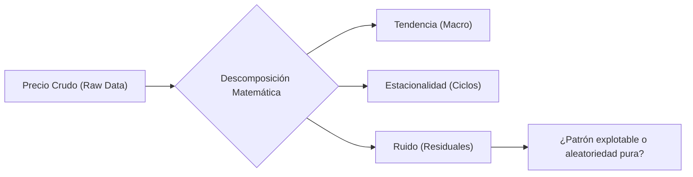

> [!abstract] Resumen
> 
> El **Análisis de Series Temporales** (TSA) es el núcleo matemático del **Trading Cuantitativo** direccional. A diferencia de la estadística clásica estática, el TSA evalúa puntos de datos cromológicos (ej. precios o retornos tick a tick) aislando el ruido para identificar patrones matemáticos predictivos y explotables.

## 1. Descomposición de la Serie Temporal

El primer paso algorítmico es la deconstrucción matemática de la serie. Todo gráfico de precios es la superposición de tres vectores fundamentales:

1. **Tendencia (Trend):** Dirección general y macro a largo plazo.
    
2. **Estacionalidad (Seasonality):** Patrones cíclicos y recurrentes en intervalos regulares (ej. estacionalidad energética, caídas de volumen vacacional).
    
3. **Ruido Blanco (White Noise / Residuals):** Fluctuaciones aleatorias, caóticas e impredecibles resultantes de restar la tendencia y la estacionalidad al activo.
    

## 2. El Axioma de Estacionariedad (Stationarity)

No es viable aplicar algoritmos predictivos o modelos de **Machine Learning** sobre datos no estacionarios.

> [!math-blue] Definición de Serie Estacionaria
> 
> Una serie es estrictamente estacionaria si sus propiedades estadísticas no cambian en el eje temporal:
> 
> 1. **Media Constante:** Oscilación alrededor de una línea base plana (cero tendencia).
>     
> 2. **Varianza Constante (Homocedasticidad):** Amplitud de fluctuaciones uniforme en el tiempo.
>     

> [!danger] El Antipatrón del Precio Absoluto
> 
> Los precios nominales de los activos (ej. $150 \rightarrow $180 \rightarrow \$140) **no** son estacionarios. Su media y volatilidad mutan. Entrenar modelos predictivos sobre precios absolutos lleva a fallos catastróficos ante cambios de régimen de mercado.

> [!tip] Transformación y Validación Estadística
> 
> Para lograr la estacionariedad, los precios nominales se transforman en **Retornos** (variación porcentual diaria). Para validar matemáticamente la estacionariedad de los retornos, se ejecuta la ****Prueba Aumentada de Dickey-Fuller**** (ADF Test). Si el p-value es $< 0.05$, la serie es apta para modelado.

## 3. Autocorrelación: La Memoria del Mercado

La autocorrelación determina si el mercado tiene "memoria" matemática, es decir, si los eventos pasados influyen probabilísticamente en el presente.

La **Función de Autocorrelación (ACF)** mide la correlación de la serie consigo misma aplicada a un rezago temporal específico (_Lag_).

- **ACF Positiva Fuerte (Lag 1):** Días alcistas atraen días alcistas. Indica presencia de un efecto inercial o ****Momentum****.
    
- **ACF Negativa Fuerte (Lag 1):** Subidas van seguidas de bajadas. Indica un régimen de **[Z-Score](../maths/zscore.md)**.
    

## 4. Familia de Modelos ARIMA (Predicción Lineal)

Para series temporales univariantes estacionarias con autocorrelación confirmada, se utiliza la familia Box-Jenkins, típicamente el modelo **ARIMA** (AutoRegressive Integrated Moving Average), definido por los parámetros $(p, d, q)$:

- **AR (AutoRegressive - $p$):** Asume que el valor en $T+1$ es una combinación lineal de los $p$ periodos anteriores.
    
- **I (Integrated - $d$):** El grado de diferenciación (restas secuenciales) necesario para forzar la estacionariedad de los datos crudos.
    
- **MA (Moving Average - $q$):** Modela la influencia de los "shocks" o residuales (errores de predicción) de los $q$ periodos previos.
    

> [!warning] Precaución Terminológica
> 
> El componente "MA" en ARIMA no hace referencia a las Medias Móviles direccionales (SMA/EMA) del análisis técnico, sino al alisado de los errores residuales.

## 5. Modelado de Volatilidad: La Familia GARCH

Los modelos lineales asumen varianza constante, un escenario irreal en finanzas debido al **Agrupamiento de Volatilidad** (Volatility Clustering): periodos de alta volatilidad agrupan alta volatilidad, y viceversa.

> [!math-orange] Heterocedasticidad Condicional
> 
> Los modelos **GARCH** (Generalized Autoregressive Conditional Heteroskedasticity) predicen la magnitud del movimiento (volatilidad), no la dirección. Son la infraestructura subyacente para el cálculo de riesgos institucionales como el ****Value at Risk**** (VaR) y la valuación en el mercado de opciones.

## 6. Cointegración: Series Temporales Multivariantes

Para operar modelos de reversión a la media en mercados tendenciales se requiere escalar del análisis univariante al multivariante.

Dos activos independientes, analizados de forma aislada, suelen ser no-estacionarios. Sin embargo, su diferencial estructural (Spread) puede ser estacionario. Este fenómeno se denomina **[Cointegración](../maths/cointegracion.md)**.

> [!example] Arquitectura Operativa
> 
> La cointegración es el motor matemático subyacente del **[Pairs Trading](../strategies/pairs_trading.md)** (ej. operando el spread entre $KO y $PEP evaluado con un **[Z-Score](../maths/zscore.md)**). Permite crear una serie temporal sintética estacionaria, aislando la estrategia de las caídas direccionales del mercado general.