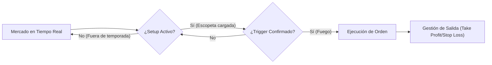
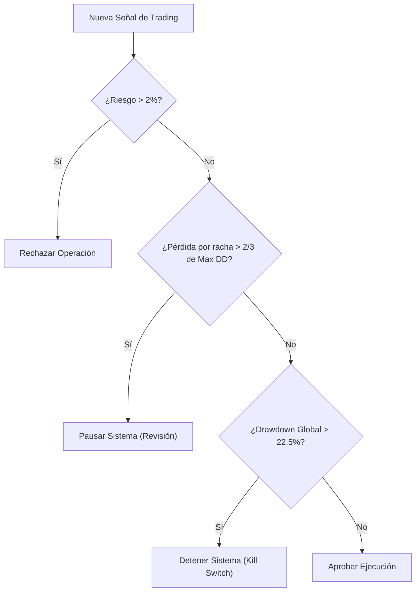
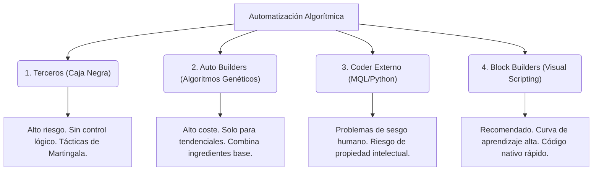

---
aliases:
  - AnatomiaSistemaTrading
tags:
  - trading/sistemas
  - finanzas/algoritmico
cssclasses:
  - style-justify
  - style-wide
---
# Introducción a los Sistemas de Trading Algorítmico

> [!abstract] Propósito
> 
> Definir las bases operativas del trading algorítmico, diferenciando entre enfoques subjetivos y sistemas unívocos, y desglosando la estructura técnica necesaria para la automatización financiera.

---

## 1. Perfiles de Análisis de Mercado

La aproximación al mercado se divide según el tipo de datos y la metodología de procesamiento:

|**Tipo de Analista**|**Enfoque Principal**|**Herramientas**|
|---|---|---|
|**Analista Técnico**|Acción del precio|Velas japonesas, indicadores chartistas.|
|**Analista Fundamental**|Entorno macroeconómico|Datos económicos, tipos de interés, política.|
|**Analista Cuantitativo**|Modelado estadístico|Grandes volúmenes de datos, probabilidad, algoritmos.|

---

## 2. Niveles de Aproximación al Mercado

Existen tres grados de madurez y rigor científico al operar:

1. **La Bolita de Cristal (Especulación Irracional):** Basada en opiniones, corazonadas o noticias aisladas. Carece de validez estadística y rigor científico.
    
2. **La Estrategia de Trading:** Conjunto de reglas que aún permite la **interpretación humana**. Es subjetiva y difícil de replicar con exactitud por un tercero o una máquina.
    
3. **El Sistema de Trading:** El estándar del trading algorítmico.
    

> [!math-blue] Definición de Sistema de Trading
> 
> Un sistema es un conjunto de reglas **100% cerradas y unívocas**. No permite interpretación. Ante un mismo escenario, diferentes operadores (o máquinas) deben ejecutar la misma orden en el mismo instante y precio exacto.

---

## 3. Anatomía de un Sistema (Las 6 Patas)

Un sistema sólido se asemeja a una estructura tridimensional que requiere estabilidad. Aunque se compone de seis elementos, la base fundamental reside en las reglas de ejecución.

### La Primera Pata: Reglas de Entrada

Un sistema profesional divide la entrada en dos fases obligatorias para evitar señales falsas:

#### Fase 1: El Setup (Contexto)

Define las condiciones idóneas del mercado. Es la "temporada de caza".

- **Función:** Filtrar si el entorno es favorable (tendencial, rango, volatilidad).
    
- **Ejemplo:** El precio debe cotizar por encima de la media móvil de 200 periodos (entorno alcista).
    

#### Fase 2: El Trigger (Disparador)

Es el evento matemático exacto que ejecuta la orden.

- **Función:** "Apretar el gatillo" una vez el setup es válido.
    
- **Ejemplo:** El cruce del oscilador Williams por debajo de un nivel de sobreventa específico.
    

---

## 4. Gestión de Ejecución y Salidas

> [!info] Diferenciación Crítica
> 
> El fracaso en la automatización suele derivar de intentar programar una "estrategia" (subjetiva) en lugar de un "sistema" (cerrado).

- **Reglas de Salida:** Deben ser tan unívocas como las de entrada. Se clasifican en:
    
    - **Stop Loss:** Límite de pérdida matemática.
        
    - **Take Profit:** Objetivo de beneficio basado en esperanza matemática.
        
    - **Salidas Temporales:** Cierre de posiciones por tiempo o fin de sesión.
        

> [!warning] Deuda Técnica
> 
> Automatizar un proceso que contiene un 1% de interpretación subjetiva garantiza el fallo del bot en condiciones de mercado real, ya que el algoritmo no puede "sentir" el mercado.

---

# Gestión de Riesgo y Posición en Sistemas de Trading

> [!abstract] Propósito
> 
> Definir los protocolos matemáticos y lógicos para la Cuarta y Quinta pata de un **SistemaDeTrading**: la Gestión del Riesgo (protección del capital base) y la Gestión de la Posición (optimización del recorrido del precio).

---

## 1. La Cuarta Pata: Gestión del Riesgo

La gestión del riesgo establece las barreras matemáticas inflexibles diseñadas para evitar la quiebra de la cuenta. Opera como un sistema escalonado de redes de seguridad.

### 1.1. Primera Red: Riesgo por Posición

Diferenciación conceptual: Un _trade_ es una orden individual; una _posición_ engloba la exposición total al mercado en una dirección específica (puede contener múltiples trades).

- **Límite Máximo Absoluto:** La exposición total acumulada no debe superar el **2%** del capital total, contemplando escenarios extremos (gaps de mercado).
    
- **Media Institucional (Recomendada):** El riesgo por posición óptimo oscila entre el **0.5% y el 1%**. A estos niveles, la quiebra técnica requiere una imposibilidad estadística (~40 operaciones fallidas consecutivas para perder un 20%).
    

### 1.2. Segunda Red: Maximum Drawdown

Representa el límite máximo de retroceso de la curva de capital respecto al depósito inicial o máximo histórico.

> [!math-red] Axioma del Punto de No Retorno
> 
> El Drawdown Máximo permitido en cualquier sistema es del **22.5% (aprox. 23%)**. Traspasar este umbral genera un déficit geométrico donde el porcentaje de rentabilidad necesario para recuperar el capital inicial se vuelve estadísticamente improbable.

### 1.3. Tercera Red: La Racha Perdedora (Drawdown Continuo)

Mide la secuencia consecutiva de operaciones cerradas en pérdida sin aciertos intermedios. Funciona como un indicador temprano de falla en el sistema.

> [!math-blue] Regla de los Dos Tercios (Separación Geométrica)
> 
> $\text{Límite Racha Perdedora} \le \frac{2}{3} \times \text{Maximum Drawdown}$
> 
> _Razón:_ Escalonar las protecciones. Si ambas métricas coinciden (ej. ambas en 20%), el sistema colapsa simultáneamente. Aplicar 2/3 permite pausar la ejecución antes de alcanzar la pérdida máxima absoluta.

---

## 2. La Quinta Pata: Gestión de la Posición

Se ejecuta una vez que el capital está expuesto en el mercado. Su objetivo es maximizar la eficiencia matemática del recorrido direccional y minimizar la excursión adversa.

### 2.1. Paradigmas de Estructura de Posición

1. **Modelo Astérix (1 Trade = 1 Posición):** Enfoque recomendado. Consiste en operar sin fraccionar entradas ni promediar precios. Permite mantener métricas de sistema limpias y evaluación objetiva.
    
2. **Modelo Obélix (Reentradas a Mercado):** Apertura de múltiples posiciones promediando lotaje (escalamiento). Aumenta exponencialmente la complejidad algorítmica y "ensucia" la trazabilidad matemática del sistema.
    

### 2.2. Gestión Dinámica: Trailing Stops

Modificación automatizada del nivel de invalidación (Stop Loss) con el mercado en curso.

- **Break Even (Equilibrio):** Movimiento del Stop al precio de entrada.
    
 > [!danger] Antipatrón Algorítmico
        > 
        > Frecuentemente ineficiente. El óptimo estadístico raramente es $0$; suele oscilar entre $+3, -5, o +10$ pips dependiendo de la volatilidad. Forzar el cero interfiere con el ruido normal del mercado.
        
- **Trailing Stop Positivo:** Seguimiento del precio a favor de la tendencia (vía medias móviles, SAR Parabólico o ATR).
    
- **Trailing Stop Negativo:** Reducción paramétrica de la distancia del Stop Loss hacia el punto de entrada mientras la operación está en flotante negativo, recortando la pérdida proyectada antes de la invalidación total.
    

> [!warning] Restricción Continua
> 
> Ejecutar un Trailing Stop continuo (transición ininterrumpida desde negativo profundo hasta positivo extenso) destruye la curva de backtesting debido a la sobreoptimización extrema.

### 2.3. Salidas Parciales

Cierre fraccionado del volumen de la posición antes del evento final (Take Profit / Stop Loss).

- **Parciales en Positivo:** Captura de liquidez (asegurar ganancias).
    
- **Parciales en Negativo (Temporizador de Salida):** Cierre porcentual de la posición si el precio permanece estancado en flotante negativo durante un tiempo excesivo (ej. $t > 24h$ y $pips < 0$). Reduce drásticamente el impacto si finalmente impacta el Stop Loss original.
    

> [!tip] Compatibilidad Algorítmica
> 
> Combinar múltiples métodos de Trailing Stop con Salidas Parciales simultáneas genera un "infierno de optimización". Es imperativo aislar variables para determinar qué componente aporta esperanza matemática real al sistema.

---

# Arquitectura de Sistemas de Trading Avanzado

> [!abstract] Propósito
> 
> Sintetizar los modelos de gestión monetaria avanzada, la estructura holística de las seis patas del trading algorítmico, los métodos de automatización técnica y los regímenes probabilísticos del mercado.

---

## 1. La Sexta Pata: Gestión Monetaria (Money Management)

La gestión monetaria opera en la capa superior del sistema, regulando el interés compuesto, el capital de reinversión y la extracción de liquidez hacia activos externos. No debe confundirse con la **GestionDelRiesgo**.

### 1.1. Principio "Aquí y Ahí"

El capital base invertido pertenece al operador ("Aquí"). Los beneficios no realizados flotantes o depositados en la cuenta del broker pertenecen al mercado ("Ahí"). La rentabilidad real solo se materializa al retirar el capital fuera del ecosistema financiero.

> [!danger] Síndrome del Pavo de Acción de Gracias
> 
> Aplicar un interés compuesto infinito (reinversión constante del 100% de ganancias) es un antipatrón crítico. Exponer la totalidad del capital asume la inexistencia de "Cisnes Negros". En un evento catastrófico, el mercado absorbe tanto el capital base como todo el beneficio acumulado.

### 1.2. Modelos de Reinversión

1. **Opción 1 (Destructiva):** Reinversión del 100%. Vulnerable a varianza extrema.
    
2. **Opción 2 (Súper Conservadora):** Retiro del 100%. Protege el capital pero anula el interés compuesto.
    
3. **Opción 3 (Óptima - Extracción Parcial):** Retiro porcentual sistemático.
    

Dentro del modelo óptimo existen dos vertientes:

- **Modelo Fijo:** Retiro y reinversión dictados por una constante estática (ej. 40% retiro, 60% reinversión).
    
- **Modelo Variable (Dinámico):** Ajuste porcentual basado en el rendimiento de la curva de capital (evaluación mensual).
    
    - _Momento Dulce (Racha Ganadora):_ Reinversión mayoritaria (ej. 70%) para aprovechar inercia.
        
    - _Momento Agrio (Drawdown):_ Retiro mayoritario (ej. 70%) para proteger liquidez.
        

> [!info] Implementación Avanzada (IA)
> 
> La gestión monetaria de alto nivel utiliza Redes Neuronales Profundas (ej. arquitecturas LSTM) para calcular dinámicamente la función óptima de retiro/reinversión basándose en las métricas en tiempo real del sistema.

---

## 2. El Cubo de Rubik del Trading (Integración Total)

Un sistema robusto requiere un mínimo de tres de estos seis pilares para no colapsar matemáticamente.

1. **Reglas de Entrada:** Setup de contexto + Disparador o Trigger.
    
2. **Reglas de Salida:** Stop Loss, Take Profit y cierres anticipados.
    
3. **Filtros:** Inhibidores de ejecución (volatilidad, exclusión/inclusión horaria).
    
4. **Gestión del Riesgo:** Riesgo por posición, Maximum Drawdown y Límite de Racha Perdedora.
    
5. **Gestión de la Posición:** Trailing stops, salidas parciales, modelo "Astérix vs Obélix".
    
6. **Gestión Monetaria:** Protocolos de retiro y reinversión (Curva de capital).
    

### 2.1. Jerarquía de Dependencia

> [!math-purple] Axioma de la Teoría de los Chimpancés
> 
> Un sistema con reglas de entrada estrictamente aleatorias (50% de probabilidad base) generará esperanza matemática positiva a largo plazo si, y solo si, posee una ejecución impecable en las dimensiones de Gestión de Riesgo, Gestión de Posición y Gestión Monetaria.

Dependiendo del régimen objetivo del bot, la segunda métrica de mayor importancia varía (siendo la primera siempre la Gestión de Riesgo):

- **Sistemas Tendenciales:** Reglas de Salida (vital para capturar el final del movimiento).
    
- **Sistemas de Scalping:** Reglas de Entrada (vital para la micro-precisión).
    
- **Sistemas de Rompimiento (Breakout):** Filtros (vital para evadir falsas rupturas o _fakeouts_).
    

> [!danger] Sistemas Alcohol (Antipatrón)
> 
> Estrategias como **Martingala, Rejilla (Grid), Coberturas (Hedge) y Arbitraje**. Dependen casi exclusivamente de una hiper-agresividad en la Gestión de la Posición. Generan curvas de rentabilidad atractivas a corto plazo, pero garantizan matemáticamente la quiebra del capital ("Margin Call") en la cola izquierda de la distribución estadística.

---

## 3. Vías de Automatización Algorítmica

Existen cinco metodologías para materializar un **SistemaDeTrading** en código:

> [!tip] Metodología Recomendada: Block Builders
> 
> Herramientas de diagramación visual permiten un prototipado veloz con compilación de código de grado profesional, facilitando la fase obligatoria de optimización matemática posterior.

---

## 4. Regímenes de Mercado y Operativa

El procesamiento estadístico del precio se clasifica en tres estados excluyentes:

|**Régimen**|**Frecuencia**|**Naturaleza Operativa**|**Estrategia Subyacente**|
|---|---|---|---|
|**Rangos**|~70%|Lateralización / Regresión a la media|Vender en banda superior, comprar en inferior.|
|**Tendencias**|~20%|Direccionalidad sostenida|Seguimiento de mínimos/máximos continuos.|
|**Rompimientos**|~10%|Explosión de volatilidad (Breakouts)|Órdenes límite en los bordes de contención.|

> [!info] Aclaración Estructural
> 
> El _Scalping_ no es un régimen de mercado; es un marco temporal de ejecución. Puede aplicarse en tendencias, rangos o rompimientos.

### 4.1. Módulo de Arranque y Diversificación

1. **Fase de Detección:** El sistema requiere de un "Módulo de Arranque" que identifique algorítmicamente el régimen actual (ej. calculando varianza o usando indicadores ADX) antes de habilitar la lógica de disparo.
    
2. **Diversificación Cuantitativa:** En lugar de buscar un "bot universal" sobre-optimizado, la arquitectura institucional exige el despliegue de **múltiples sistemas hiper-especializados** (ej. un experto en rangos + un experto en tendencias) ejecutándose en paralelo. Cuando el mercado transiciona, las ganancias del sistema en su régimen dominante compensan el drawdown del sistema en recesión.