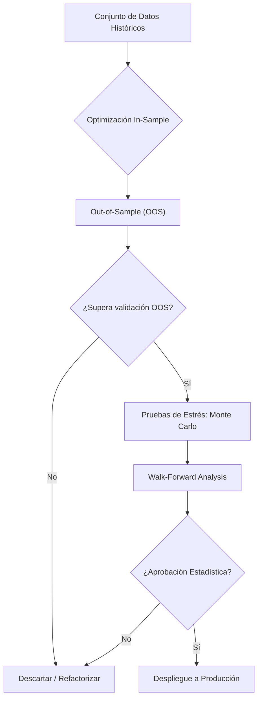

> [!abstract] Propósito
> 
> El **Backtesting** es el proceso de reconstruir el comportamiento histórico de una estrategia de trading. Constituye un experimento científico riguroso diseñado para validar la existencia de una ventaja estadística (_edge_) en el mercado frente al simple ruido aleatorio.

## 1. Enfoques Arquitectónicos de Backtesting

Existen dos arquitecturas fundamentales para construir un motor de backtesting, diferenciadas por su fidelidad temporal y velocidad de ejecución.

### A. Backtesting Vectorizado (Research)

Procesa la totalidad de los datos simultáneamente como matrices operando sobre herramientas como **Python** (Pandas/NumPy).

- **Ventaja:** Velocidad computacional extrema para iteración de hipótesis.
- **Desventaja:** Ausencia del factor tiempo y modelado de ejecución. Alta propensión a incurrir en Look-Ahead-Bias (usar datos del futuro sin querer).

### B. Backtesting Basado en Eventos (Producción)

Arquitectura implementada en lenguajes de alto rendimiento (ej. **Rust**), procesando datos secuencialmente (barra por barra o _tick por tick_) y disparando eventos de estado.

- **Ventaja:** Fidelidad absoluta al mercado real. Modela latencias de red, colas de ejecución y estados parciales.
- **Desventaja:** Alta complejidad arquitectónica y menor velocidad de iteración frente al modelo vectorizado.

## 2. Componentes Críticos del Motor

Un entorno de simulación de grado institucional requiere la implementación obligatoria de los siguientes módulos de fricción:

- **Modelado de Fricción:** Incorporación de comisiones fijas/variables, _Slippage_ (diferencial de precio de ejecución) y _Market Impact_ (impacto de la propia orden en la liquidez).
- **Costos de Capital:** Deducción de _funding rates_ o intereses por el margen retenido en operaciones apalancadas.
- **Latencia de Ejecución:** Simulación del retraso temporal de red entre la generación de la señal y la confirmación del _exchange_.
    

## 3. Métricas de Evaluación

El desempeño no se evalúa por el retorno bruto, sino mediante el [QT - 5.Sharpe Ratio](../portfolio/sharpe_ratio.md), [Sharpe Ratio](../portfolio/sharpe_ratio.md).

> [!math-blue] [QT - 5.Sharpe Ratio](../portfolio/sharpe_ratio.md)
> 
> $$\text{**[[QT - 5.Sharpe Ratio**]]} = \frac{R_p - R_f}{\sigma_p}$$
> 
> _Donde $R_p$ es el retorno del portafolio, $R_f$ la tasa libre de riesgo y $\sigma_p$ la volatilidad._

- **[QT - 6.Sortino Ratio](../portfolio/sortino_ratio.md):** Evolución del Sharpe que penaliza exclusivamente la volatilidad bajista (desviación negativa).
- **Profit Factor:** Relación bruta absoluta entre ganancias y pérdidas. El rango objetivo para un sistema robusto oscila entre 1.5 y 2.0.
- **Expectativa Matemática:** Valor monetario proyectado de ganancia por cada unidad de capital arriesgada.
    
## 4. Antipatrones y Sesgos Críticos

Los siguientes errores lógicos invalidan cualquier resultado estadístico obtenido durante la simulación:

> [!danger] Sobreajuste (Overfitting)
> 
> Forzar la parametrización para lograr una adaptación perfecta a la curva de datos históricos. Una estrategia dependiente de múltiples indicadores y decenas de variables optimizadas carece de robustez predictiva; es una memorización del pasado.

- **Look-ahead Bias:** Permeabilidad de datos futuros en decisiones pasadas (ej. evaluar el precio de cierre de una vela en curso para detonar una orden al inicio de la misma).
    
- **Survivorship Bias (Sesgo de Supervivencia):** Evaluar el sistema exclusivamente sobre activos actualmente listados, excluyendo compañías o _tokens_ que quebraron o fueron deslistados durante el periodo histórico.
    

## 5. Pipeline de Validación Rigurosa

El backtest estándar es únicamente la primera fase. Una estrategia exige transitar el siguiente flujo de estrés matemático:

1. **Out-of-Sample (OOS):** Reserva estricta de un fragmento de datos (típicamente 30%) oculto al algoritmo durante el diseño. Fallar en esta fase implica descarte inmediato.
    
2. **Monte Carlo:** Permutación aleatoria de la secuencia de _trades_ resultantes para proyectar distribuciones de probabilidad y detectar el riesgo de ruina.
    
3. **Walk-Forward Analysis:** Segmentación temporal dinámica. Se optimiza en la ventana $T_1$, se valida en $T_2$, y la ventana se desplaza iterativamente, emulando la degradación continua del mercado real.