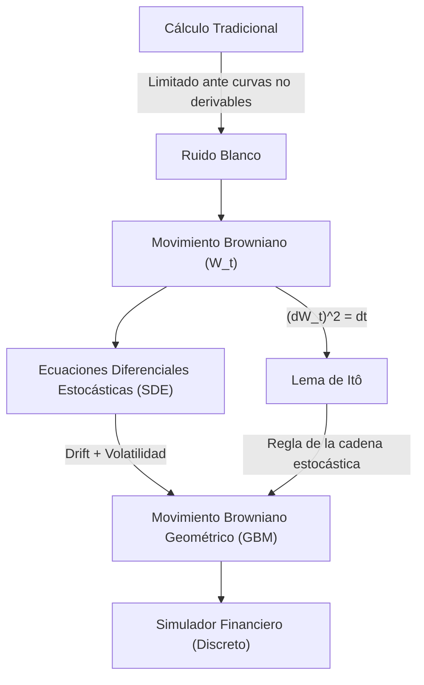

> [!abstract] Propósito
> 
> El cálculo estocástico es la rama de las matemáticas diseñada para modelar sistemas que cambian con el tiempo sujetos a una aleatoriedad continua. Mientras el cálculo tradicional de Newton y Leibniz predice trayectorias exactas en el vacío, el cálculo estocástico modela el caos, como una partícula en un fluido hirviendo o el precio de un activo en los mercados financieros.

## 1. El Problema del Cálculo Tradicional

El cálculo tradicional exige funciones suaves y derivables. Sin embargo, variables complejas como los precios en los mercados financieros (o partículas en física cuántica) están sujetas a un "ruido blanco" incesante.

Si se analiza el gráfico de un precio tick a tick, el resultado es un zigzag continuo, pero **no derivable**. No existe una "velocidad" constante en ningún punto microscópico porque el valor rebota constantemente. Ante esta falta de derivabilidad, las reglas matemáticas clásicas colapsan.

## 2. El Movimiento Browniano ($W_t$)

Para construir un nuevo cálculo, se requiere un modelo matemático que represente el ruido puro. A esto se le conoce como **Movimiento Browniano** o Proceso de Wiener ($W_t$).

> [!math-blue] Axiomas y Variación Cuadrática del Movimiento Browniano
> 
> El proceso $W_t$ se rige por tres propiedades fundamentales:
> 
> 1. **Origen en cero:** $W_0 = 0$.
>     
> 2. **Incrementos independientes:** El comportamiento futuro no depende matemáticamente del histórico pasado.
>     
> 3. **Distribución Gaussiana:** Sus incrementos tienen una distribución normal con media $0$ y varianza igual al diferencial de tiempo ($dt$).
>     
> 
> La variación cuadrática dicta que el ruido es tan violento que el cuadrado del incremento aleatorio equivale al tiempo transcurrido:
> 
> $$(dW_t)^2 = dt$$

## 3. Ecuaciones Diferenciales Estocásticas (SDE)

Las SDE integran la matemática del ruido para describir sistemas reales. Su arquitectura estándar divide el movimiento de una variable ($X_t$) en una componente determinista y otra de difusión aleatoria.

> [!math-green] Estructura Estándar SDE
> 
> $$dX_t = \mu(t, X_t)dt + \sigma(t, X_t)dW_t$$
> 
> - **Drift (Tendencia general):** $\mu(t, X_t)dt$. Se calcula con las reglas del cálculo tradicional (la "corriente del río").
>     
> - **Difusión (Ruido estocástico):** $\sigma(t, X_t)dW_t$. Representa la volatilidad y aleatoriedad del sistema (los "remolinos").
>     

### Movimiento Browniano Geométrico (GBM)

Es la SDE de referencia en la industria financiera. Modela la evolución del precio de los activos ($S_t$), basándose en la premisa de que los retornos logarítmicos siguen una distribución normal.

> [!math-orange] Modelo GBM
> 
> $$dS_t = \mu S_t dt + \sigma S_t dW_t$$

## 4. El Lema de Itô

El Lema de Itô es el motor matemático del cálculo estocástico (equivalente a la "regla de la cadena" clásica) y el pilar fundamental que sustenta modelos de valoración de opciones como Black-Scholes. Define la evolución temporal de una función $f$ sujeta a un proceso estocástico $X_t$.

> [!math-purple] Formulación del Lema de Itô
> 
> $$df(t, X_t) = \left( \frac{\partial f}{\partial t} + \mu \frac{\partial f}{\partial x} + \frac{1}{2} \sigma^2 \frac{\partial^2 f}{\partial x^2} \right) dt + \left( \sigma \frac{\partial f}{\partial x} \right) dW_t$$

> [!danger] Riesgo de Omisión Estocástica
> 
> El término adicional $\frac{1}{2} \sigma^2 \frac{\partial^2 f}{\partial x^2}$ emerge estrictamente porque $(dW_t)^2 = dt$. El ruido acumulado genera una "curvatura" matemática que el cálculo determinista asume como cero. Omitir este término provoca el colapso inmediato de cualquier simulación o modelo de pricing financiero.

## 5. Flujo Conceptual y Simulación

La interacción entre la tendencia y la volatilidad puede resolverse y visualizarse utilizando un simulador que resuelva la ecuación discreta del GBM.

Fragmento de código

