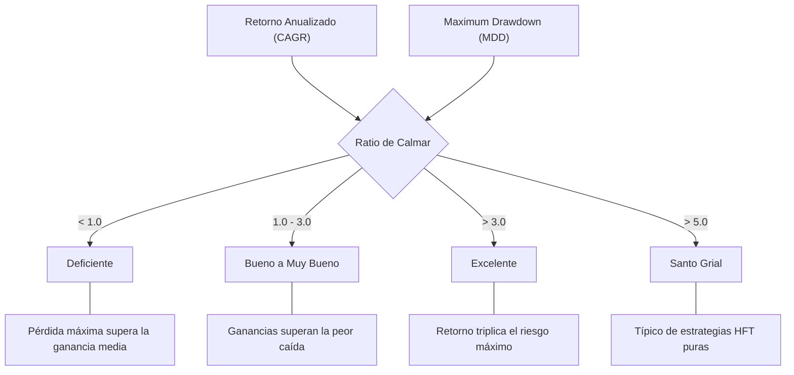

> [!abstract] Propósito
> 
> El Ratio de Calmar es una métrica de rendimiento ajustada al riesgo, fundamental en el ecosistema de hedge funds y trading cuantitativo. A diferencia de las métricas que evalúan la volatilidad general, este ratio aísla y cuantifica el peor escenario posible experimentado por una estrategia de inversión.

## Definición Matemática

> [!math-blue] Ecuación Principal
> 
> $$Ratio\ de\ Calmar = \frac{Retorno\ Anualizado\ (CAGR)}{Maximum\ Drawdown\ (MDD)}$$

> [!info] Restricción de Signo
> 
> El valor del Maximum Drawdown (MDD) debe introducirse en la fórmula como un valor absoluto (número positivo).

## Componentes Clave

1. **Retorno Anualizado (CAGR)**: Tasa de crecimiento anual compuesto de la estrategia.
    
    - _Requisito Estadístico_: Se requiere un histórico mínimo de 36 meses (3 años) para que el ratio posea validez estadística.
        
2. **Maximum Drawdown (MDD)**: Máxima caída porcentual histórica registrada desde un máximo absoluto (pico) hasta un mínimo relativo (valle) previo a la recuperación del capital. Cuantifica el riesgo extremo de la curva de capital.
    

## Interpretación de Resultados

El valor resultante indica la proporción de rendimiento generado por cada unidad de riesgo de caída máxima asumida.

## Comparativa Estructural: Calmar vs. Sharpe

> [!tip] Criterio de Selección de Métrica
> 
> Las firmas cuantitativas priorizan el Ratio de Calmar sobre el de Sharpe debido a la asimetría del riesgo en operaciones en vivo.

- **Ratio de Sharpe**: Penaliza la volatilidad total bidireccional al utilizar la desviación estándar en el denominador. Clasifica las desviaciones alcistas abruptas (ganancias rápidas) como incremento de riesgo.
    
- **Ratio de Calmar**: Métrica de riesgo asimétrica. Ignora la volatilidad alcista y se concentra estrictamente en la profundidad de la caída.
    

> [!danger] Riesgo de Ruina
> 
> La insolvencia de los fondos no se produce por alta volatilidad positiva, sino por superar el margen de tolerancia de los brókers (Margin Call) o por el pánico de los inversores durante el Maximum Drawdown. El Ratio de Calmar audita directamente este vector de fallo.