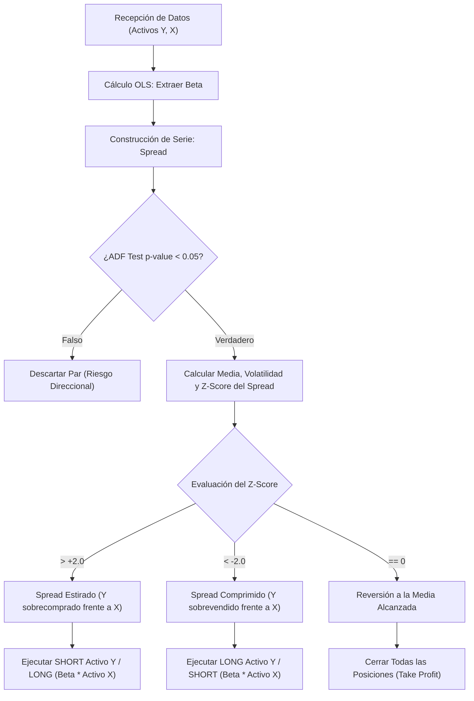

> [!abstract] Resumen
> 
> La **Cointegración** es la técnica matemática fundacional del arbitraje estadístico en el **Trading Cuantitativo**. Resuelve la no estacionariedad de los precios absolutos combinando dos o más series temporales divergentes en una única serie sintética estacionaria, permitiendo la aplicación predecible de modelos de **Reversión a la Media**.

## Analogía Estructural

Para conceptualizar este fenómeno geométrico frente al comportamiento caótico del mercado, se emplea un modelo mental clásico:

> [!example] El Borracho y el Perro
> 
> Un hombre ebrio camina erráticamente por un parque (trayectoria no estacionaria, **Paseo Aleatorio**). Su perro corretea en múltiples direcciones persiguiendo estímulos (otro paseo aleatorio no estacionario). Predecir sus coordenadas exactas en el tiempo es imposible.
> 
> Sin embargo, el perro está atado al hombre con una correa. La correa impone un límite matemático a la distancia entre ambos. La medición continua de esta **distancia (Spread)** genera una serie temporal estacionaria que siempre oscila y retorna a la media (cuando el perro vuelve al dueño).
> 
> - **Dueño:** Activo A.
>     
> - **Perro:** Activo B.
>     
> - **Correa:** Fuerza económica que los cointegra.
>     

## Correlación vs. Cointegración

> [!danger] Peligro de Ruina
> 
> Confundir correlación con cointegración es un antipatrón crítico en el diseño algorítmico. Dos activos pueden tener 95% de correlación y no estar cointegrados, resultando en pérdidas estructurales irrevocables.

|**Métrica**|**Enfoque Temporal**|**Dinámica Subyacente**|**Analogía**|
|---|---|---|---|
|**Correlación**|Corto Plazo (Direccional)|Los activos se mueven en la misma dirección diaria. Pueden divergir permanentemente a largo plazo.|Dos coches a 100 km/h. Uno va al norte, otro al sur. Eventualmente se separan para siempre.|
|**Cointegración**|Largo Plazo (Equilibrio)|La distancia entre activos (Spread) está limitada estadísticamente.|Dos vagones acoplados físicamente en el mismo tren.|

## Formulación Matemática (Método Engle-Granger)

Si se evalúan los activos $Y$ y $X$, no se restan los precios absolutos nominales. Se requiere calcular el factor de equilibrio o **Hedge Ratio ($\beta$)** en dos pasos metodológicos:

### Paso 1: Regresión Lineal de Mínimos Cuadrados (OLS)

> [!math-blue] Ecuación Engle-Granger
> 
> Se ejecuta una regresión lineal sobre los precios para calcular la cantidad de acciones de $X$ requeridas para neutralizar una acción de $Y$:
> 
> $$Y_t = \alpha + \beta X_t + \epsilon_t$$
> 
> Aislamos el error residual ($\epsilon_t$) para generar la serie sintética (**Spread**):
> 
> $$Spread_t = Y_t - (\beta \times X_t)$$

### Paso 2: Validación de Estacionariedad

> [!info] Filtro ADF
> 
> El $Spread_t$ resultante se somete a la ****Prueba Aumentada de Dickey-Fuller** (ADF Test)**.
> 
> - Si el `p-value > 0.05`: Se rechaza la cointegración.
>     
> - Si el `p-value < 0.05`: Relación matemáticamente significativa confirmada. El Spread es apto para operar.
>     

## Aplicación Algorítmica: Pairs Trading

Con la serie temporal sintética validada, el sistema entra en un régimen ****Market Neutral****, siendo indiferente a colapsos macroeconómicos o fases tendenciales. Opera aislando el spread con un **[Z-Score](../maths/zscore.md)**.

## Riesgos del Modelo

> [!warning] Ruptura Estructural (Structural Break)
> 
> La cointegración describe un vínculo económico histórico, no una constante física. Cambios fundamentales (fusiones, innovación tecnológica disruptiva, nueva regulación) alteran permanentemente este vínculo. En este escenario, la "correa" se rompe, y el spread jamás revierte a su media anterior. Para mitigar esto, el ADF test debe recalcularse en bucles iterativos utilizando una ventana móvil temporal (_rolling window_).