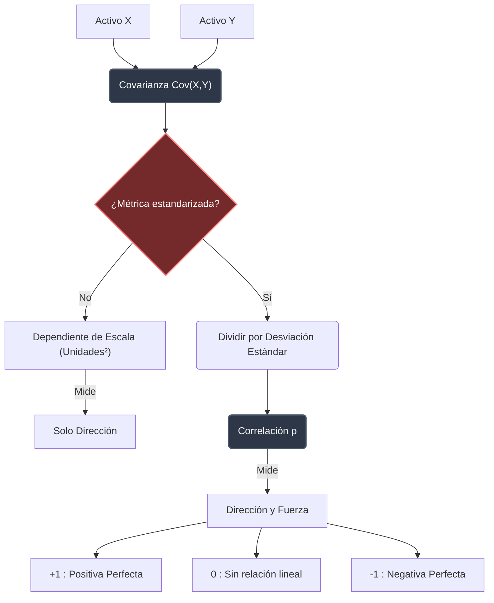

> [!abstract] Propósito
> 
> La Covarianza y la Correlación son herramientas estadísticas fundamentales para medir la relación entre dos variables. En el contexto de trading cuantitativo, permiten calcular el riesgo de una cartera, identificar relaciones inversas como coberturas y construir algoritmos de arbitraje.

## 1. Covarianza ($Cov(X,Y)$)

La covarianza mide la dirección en la que dos variables (o activos financieros) se mueven juntas.

- **Positiva**: Si $X$ sube, $Y$ tiende a subir.
    
- **Negativa**: Si $X$ sube, $Y$ tiende a bajar (ej. Oro y Dólar).
    

> [!math-blue] Fórmulas de Covarianza
> 
> **Definición fundamental**:
> 
> $$Cov(X,Y) = E[(X - E[X])(Y - E[Y])]$$
> 
> (El [QT(PE) - 7.Valor Esperado](../prob_stats/valor_esperado.md) del producto de las desviaciones de cada variable respecto a su media).
> 
> **Atajo algebraico** (_Expectation of product minus product of expectations_):
> 
> $$Cov(X,Y) = E[XY] - [QT(PE) - 7.Valor Esperado](../prob_stats/valor_esperado.md)E[Y]$$

### 1.1. El Problema de la Escala

> [!warning] Deuda de dimensionalidad
> 
> La covarianza es estrictamente dependiente de la escala. Si los precios se miden en dólares, la covarianza se expresa en "dólares al cuadrado". Un cambio de divisa o unidad altera la magnitud absoluta del resultado, por lo que **solo indica dirección, no fuerza de la relación**.

## 2. Propiedades Críticas de la Covarianza

Las siguientes reglas gobiernan la manipulación algebraica de la covarianza en sistemas complejos o evaluación de múltiples activos:

> [!math-green] Axiomas de Covarianza
> 
> 1. **Relación con la Varianza**: La covarianza de un activo consigo mismo es su propia dispersión al cuadrado.
>     
>     $$Cov(X,X) = Var(X)$$
>     
> 2. **Bilinealidad**: La covarianza es lineal en ambos argumentos. Permite desglosar el riesgo de carteras ponderadas.
>     
>     $$Cov(aX_1 + bX_2, Y) = aCov(X_1,Y) + bCov(X_2,Y)$$
>     

> [!danger] Falsa Independencia
> 
> Si dos variables son independientes, su covarianza es cero ($Cov(X,Y) = 0$). **La inversa no es cierta**. Una covarianza de cero indica ausencia de relación _lineal_, pero las variables pueden mantener dependencias complejas no lineales (ej. $Y = X^2$).

## 3. Correlación ($\rho$)

Para resolver la dependencia de la escala inherente a la covarianza, se utiliza el coeficiente de Correlación ($\rho$). Es una métrica normalizada e independiente de la escala, estrictamente delimitada en el rango $[-1, 1]$.

> [!math-red] Fórmula de Correlación de Pearson
> 
> Se divide la covarianza entre el producto de las desviaciones estándar de ambas variables, cancelando así las unidades de medida:
> 
> $$\rho(X,Y) = \frac{Cov(X,Y)}{\sqrt{Var(X)Var(Y)}}$$

### 3.1. Interpretación de $\rho$

- $\rho = 1$: **Correlación positiva perfecta.** Representación gráfica como una línea recta ascendente.
    
- $\rho = -1$: **Correlación negativa perfecta.** Representación gráfica como una línea recta descendente milimétrica.
    
- $\rho = 0$: **Sin relación lineal.**
    

## 4. Diagrama Conceptual de Flujo Estadístico

