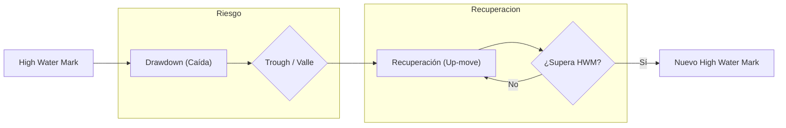

> [!abstract] Definición
> 
> El **Drawdown (DD)** es la métrica que cuantifica la reducción del capital de una estrategia o portafolio desde un máximo histórico (_Peak_) hasta su punto más bajo (_Trough_) antes de alcanzar un nuevo máximo. Es el indicador principal del riesgo de pérdida latente y del impacto psicológico en la ejecución del sistema.

---

## 1. Métricas Críticas del Drawdown

Para evaluar la robustez de un sistema en [Backtesting](../strategies/backtesting.md), utilizamos principalmente dos dimensiones:

### A. Maximum Drawdown (Max DD)

Es la caída porcentual más profunda registrada. Representa el "peor escenario histórico".

> [!math-blue] Fórmula del Drawdown
> 
> $$DD_t = \frac{HWM - P_t}{HWM}$$
> 
> Donde:
> 
> - $HWM$ (High Water Mark): Es el valor máximo histórico alcanzado por la cuenta hasta el momento $t$.
>     
> - $P_t$: Valor actual del portafolio.
>     

### B. Drawdown Duration

Mide el tiempo (en barras o días) que el sistema permanece por debajo del _High Water Mark_. Un drawdown prolongado es a menudo más peligroso que uno profundo, ya que puede invalidar la tesis de inversión por costo de oportunidad o fatiga del inversor.

---

## 2. Asimetría Matemática de la Recuperación

La relación entre pérdida y recuperación no es lineal, sino geométrica. A medida que el drawdown aumenta, el retorno necesario para volver al punto de equilibrio (_Breakeven_) crece exponencialmente.

| **Pérdida de Capital (DD)** | **Retorno Necesario para Recuperar** |
| --------------------------- | ------------------------------------ |
| 10%                         | 11.1%                                |
| 20%                         | 25.0%                                |
| 30%                         | 42.9%                                |
| **50%**                     | **100.0%**                           |
| 70%                         | 233.3%                               |
| 90%                         | 900.0%                               |

> [!danger] Regla Crítica
> 
> Debido a esta asimetría, priorizamos la preservación del capital sobre la maximización de beneficios. Implementamos un **KillSwitch** si el Max DD excede los límites teóricos definidos en las simulaciones de [MonteCarlo](../strategies/montecarlo.md).

---

## 3. Visualización del Ciclo de Drawdown

El siguiente flujo describe el ciclo de vida de un retroceso hasta la recuperación del capital:

---

## 4. Aplicación en el Diseño de Sistemas

Implementamos el drawdown como eje central en tres áreas de la arquitectura de trading:

1. **Filtro de Viabilidad:** Descartamos cualquier estrategia cuyo Max DD histórico supere el 20-25% (dependiendo del mandato del fondo).
    
2. **Ratio de Calmar:** Evaluamos la eficiencia del sistema dividiendo el retorno anualizado entre el Max DD.
  
> [!math-red] Ratio de Calmar
> 
> $$Ratio\ Calmar = \frac{CAGR}{Max\ Drawdown}$$
>
> Donde:
> - CAGR indica el retorno anualizado

3. **Position Sizing:** Ajustamos el tamaño de la posición basándonos en la volatilidad y el DD esperado para evitar el riesgo de ruina y mantener el sistema dentro de los márgenes de operación permitidos por la gestión de riesgos de **GestionDeCapital**.
    

> [!tip] Recomendación
> 
> Siempre comparamos el Max DD del backtest con pruebas de estrés de datos fuera de muestra (_Out-of-Sample_) para identificar si el sistema está sobreajustado (_Overfitting_).