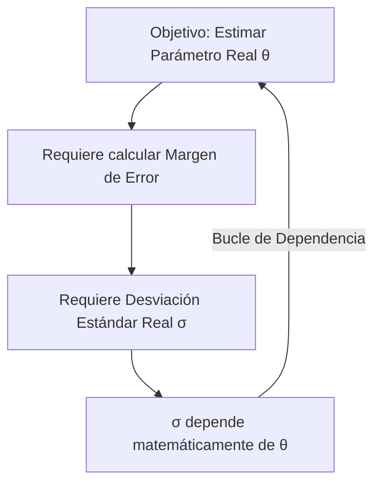

> [!abstract] Propósito de la nota
> 
> Este documento aterriza la teoría abstracta del Teorema del Límite Central (CLT) en la herramienta más práctica del análisis cuantitativo: los **Intervalos de Confianza (CI)**. En trading, nunca se obtiene el parámetro verdadero de una estrategia (su rentabilidad o win-rate real futuro); solo se dispone de una estimación histórica. El intervalo de confianza cuantifica la fiabilidad matemática de dicha estimación.

## 1. La Anatomía del Intervalo de Confianza

Un intervalo de confianza está estructurado por dos componentes matemáticos derivados directamente de los principios de la estadística inferencial:

- **El Centro:** Determinado por la Ley de los Grandes Números (LLN). Representa el estimador empírico ($\hat{\theta}$). Si un backtest muestra un retorno promedio del 2% por operación, el centro del intervalo se fija en 2%.
    
- **El Rango (Anchura):** Determinado por el Teorema del Límite Central (CLT). Representa el margen de error estadístico. Su magnitud depende directamente de la volatilidad intrínseca de los datos y del tamaño de la muestra analizada.
    

## 2. La Fórmula Asintótica

La ecuación estándar para delimitar los umbrales inferior y superior de un intervalo de confianza se define formalmente como:

$$\theta \in \left[ \hat{\theta} - \frac{\sigma}{\sqrt{n}}q_{\alpha/2}, \ \hat{\theta} + \frac{\sigma}{\sqrt{n}}q_{\alpha/2} \right]$$

### Desglose de Parámetros

- $\hat{\theta}$ (_Theta sombrero_): El estimador empírico (ej. la media muestral de los retornos en el backtest).
    
- $\sigma$ (_Sigma_): La desviación estándar (volatilidad) real y teórica de la población de datos.
    
- $n$: El tamaño de la muestra (número total de operaciones ejecutadas o días de negociación). Al encontrarse en el denominador como $\sqrt{n}$, un incremento en el volumen de datos reduce el margen de error, estrechando el intervalo.
    
- $q_{\alpha/2}$: El cuantil de la Distribución Normal Estándar $\mathcal{N}(0,1)$, denominado en la industria como **[QT - 10.Z-Score](../maths/zscore.md) crítico**. Para un nivel de confianza del 95% (riesgo de error $\alpha = 0.05$), se busca el valor que distribuye el 2.5% de probabilidad en cada cola ($\alpha/2$), el cual corresponde a **1.96**.
    

## 3. La "Paradoja" de la Varianza

Para evaluar y resolver la ecuación asintótica se requiere conocer la desviación estándar real ($\sigma$). Sin embargo, en escenarios prácticos de trading, $\sigma$ es desconocida y suele ser una función matemática dependiente del parámetro real que se intenta descubrir, generando un bucle de dependencia lógica.

## 4. Soluciones Cuantitativas

Para romper la paradoja de la varianza e implementar el cálculo en entornos de producción, la industria recurre a dos metodologías específicas:

### Método A: La Cota Conservadora (Peor Escenario)

Si las operaciones se modelan bajo una distribución de Bernoulli (clasificación binaria: acierto o fallo), la varianza teórica se expresa como:

$$\sigma^2 = p(1-p)$$

Esta función cuadrática alcanza su valor máximo absoluto cuando $p = 0.5$, donde:

$$0.5 \times (1 - 0.5) = 0.25$$

Asumiendo este escenario de máxima incertidumbre ($\sigma = \sqrt{0.25} = 0.5$), se sustituye el parámetro $\sigma$ por $\frac{1}{2}$ en la ecuación original. Esto proporciona un intervalo estadísticamente seguro y robusto ante cualquier circunstancia, a costa de una mayor holgura en el rango:

> [!math-blue] Intervalo de Confianza Conservador (Bernoulli)
> 
> $$\theta \in \left[ \hat{\theta} - \frac{1}{2\sqrt{n}}q_{\alpha/2}, \ \hat{\theta} + \frac{1}{2\sqrt{n}}q_{\alpha/2} \right]$$

### Método B: El Teorema de Slutsky (Método "Plug-in")

Constituye el estándar operativo en el trading de alta frecuencia y análisis cuantitativo de series temporales.

> [!math-purple] Teorema de Slutsky (Propiedad Asintótica)
> 
> Si el tamaño de la muestra $n$ es suficientemente grande ($n \to \infty$), la convergencia en distribución permite sustituir la desviación estándar poblacional teórica ($\sigma$) por la desviación estándar muestral calculada directamente de los datos históricos ($\hat{\sigma}$):
> 
> $$\sqrt{n} \frac{\bar{X}_n - \mu}{\hat{\sigma}} \xrightarrow{(d)}_{n \to \infty} \mathcal{N}(0,1)$$

El error analítico introducido al incorporar un estimador dentro de otro estimador converge a cero de forma asintótica, permitiendo la evaluación directa del intervalo sobre cualquier conjunto de datos empíricos sin necesidad de asumir parámetros teóricos fijos.