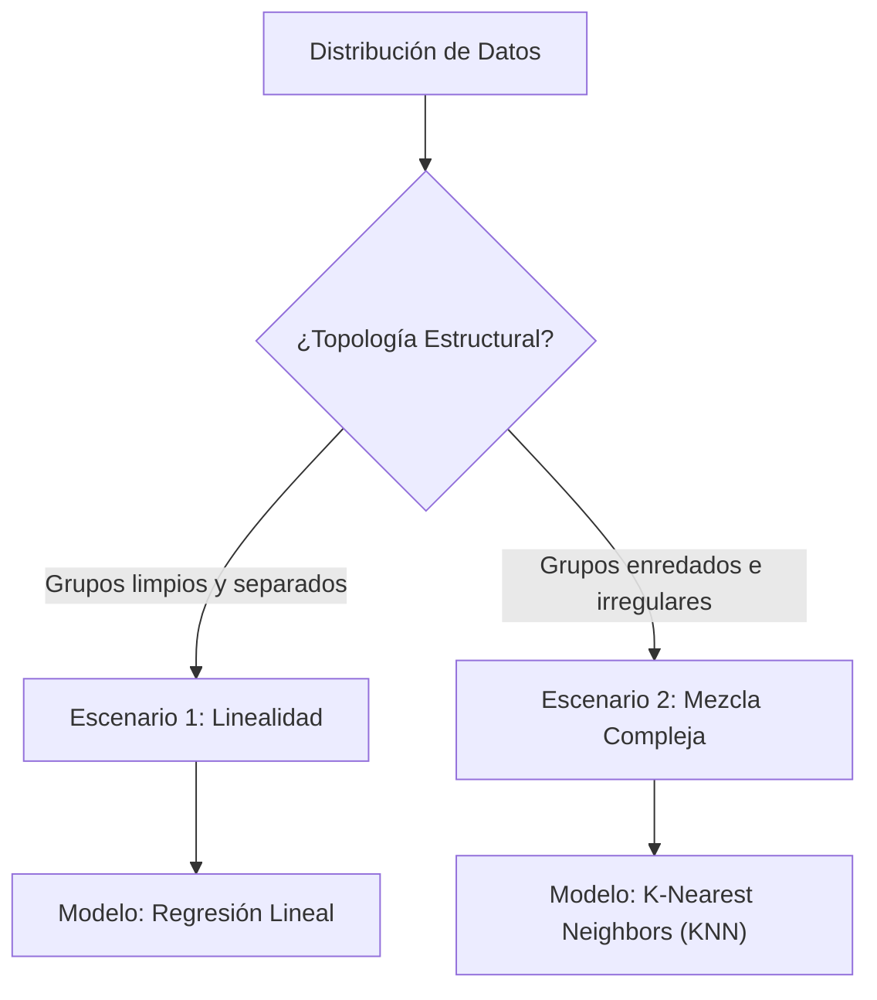

> [!abstract]
> 
> Análisis conceptual de las matemáticas subyacentes en la selección y evaluación de modelos predictivos. Se abandona la perspectiva puramente algebraica para abordar la intuición geométrica de los datos, redefiniendo conceptos críticos como el sesgo, la varianza y los grados de libertad mediante la comparación de los extremos algorítmicos: **RegresionLineal** y [KNN](../ml/modelos_lineales_knn.md).

## 1. La Geometría de los Datos

El rendimiento de un modelo depende estrictamente de la topología y distribución de los datos subyacentes.

- **Escenario 1 (Dominio Lineal):** Los datos de cada clase conforman agrupaciones nítidas y disjuntas (distribuciones Gaussianas independientes). Permite la separación perfecta mediante un único hiperplano recto.
    
- **Escenario 2 (Dominio Vecinal):** Los datos presentan topologías enredadas e irregulares. Un hiperplano provocaría un corte arbitrario con alto error. Requiere el aislamiento mediante regiones locales independientes (islas o regiones de [Voronoi](../maths/voronoi.md)).
    

## 2. Sesgo vs. Varianza: Intuición de Diseño

Más allá de ser métricas de error, representan directrices de diseño en la arquitectura del modelo.

> [!math-blue] Definición de Sesgo (Bias)
> 
> Restricciones teóricas impuestas _a priori_ sobre el modelo geométrico.
> 
> Representa el grado de "terquedad" algorítmica. Un alto sesgo implica reglas estrictas e inflexibles (ej. "el mundo se comporta de forma perfectamente lineal").

> [!math-red] Definición de Varianza (Variance)
> 
> Medida de inestabilidad estructural del modelo frente a perturbaciones en los datos de entrada.
> 
> Representa la sensibilidad al ruido estadístico. Una alta varianza implica que la alteración de un único dato de entrenamiento reestructura severamente las fronteras de decisión.

## 3. Extremos Algorítmicos: 1-NN vs. Regresión Lineal

La comparación entre la flexibilidad máxima y la rigidez extrema ilustra el _trade-off_ fundamental del aprendizaje automático.

### 1-Nearest Neighbor (1-NN)

- **Sesgo:** Mínimo. No asume la forma subyacente de la distribución.
    
- **Varianza:** Catastrófica. Un único dato anómalo redibuja los límites de decisión locales.
    
- **Error de Entrenamiento:** Siempre es $0$.
    

> [!warning] Sobreajuste (Overfitting) en 1-NN
> 
> Al carecer de sesgo, el algoritmo simplemente memoriza el espacio de entrada. Lograr un $100\%$ de precisión en entrenamiento es una consecuencia matemática determinista, no un indicador de capacidad predictiva.

### Regresión Lineal

- **Sesgo:** Alto. Obliga a los datos a ajustarse a un hiperplano geométrico.
    
- **Varianza:** Muy baja. Las fronteras de decisión son altamente estables ante inyecciones de ruido puntuales.
    

> [!tip] Hackeando el Sesgo Lineal
> 
> Es posible mitigar el alto sesgo de la regresión lineal inyectando transformaciones polinómicas en el preprocesamiento (ej. elevar variables a potencias). Esto permite capturar no-linealidad sin abandonar la estabilidad del modelo subyacente.

## 4. Complejidad y Grados de Libertad (df)

Todo conjunto de datos posee una complejidad inherente que debe ser asimilada por las suposiciones teóricas del diseñador o por la propia estructura parametrizada del modelo. A menores suposiciones, mayor demanda de complejidad estructural.

> [!math-green] Grados de Libertad (Degrees of Freedom)
> 
> Capacidad matemática de un modelo para contorsionarse y adaptarse a variaciones.
> 
> A mayor $df$, menor sesgo y mayor varianza.

En el modelo de $k$-Nearest Neighbors, los grados de libertad efectivos se calculan relacionando el volumen de datos total ($n$) con la cardinalidad del vecindario evaluado ($k$):

$$ df = \frac{n}{k} $$

- **Caso Extremo (Máxima Libertad):** Si $k = 1$, los grados de libertad ascienden a $n$. El modelo asigna un grado de libertad por cada observación, derivando en sobreajuste puro.
    
- **Caso Restringido (Mayor Rigidez):** Si $k = 100$, los grados de libertad colapsan a $n/100$. El modelo consolida bloques masivos de información, mitigando la varianza pero incrementando el sesgo mediante el promediado.