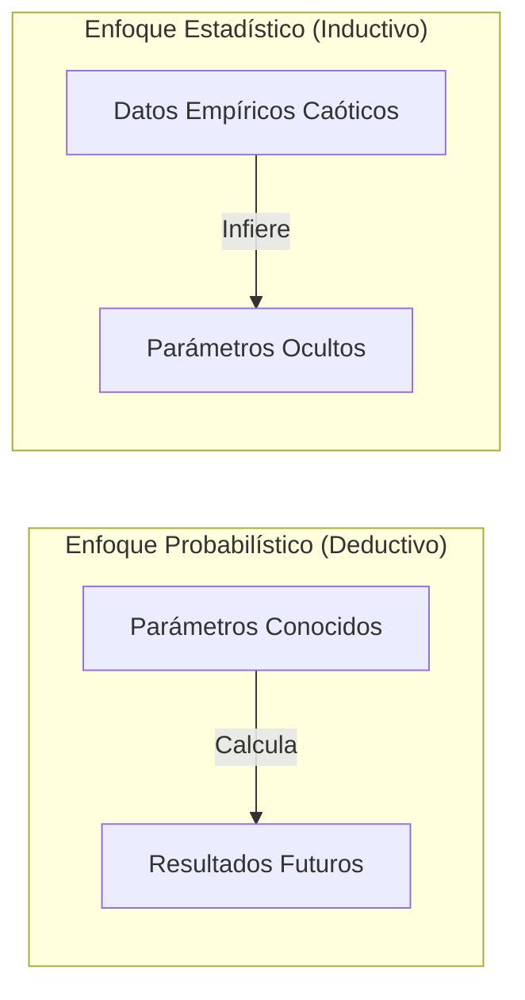
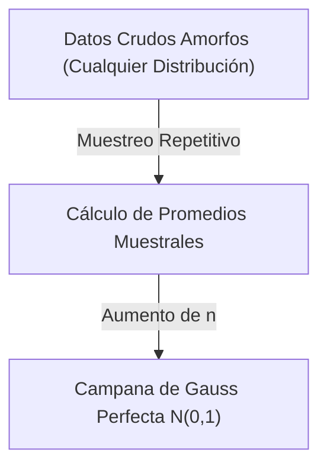

> [!abstract] Propósito de la nota
> 
> Esta sección marca el salto definitivo desde la probabilidad pura hacia la estadística inferencial aplicada. Se analiza cómo deducir las reglas y parámetros ocultos que gobiernan los mercados financieros a partir de datos empíricos mediante dos pilares matemáticos: la Ley de los Grandes Números (LLN) y el Teorema del Límite Central (CLT).

## 1. El Cambio de Paradigma: Probabilidad vs. Estadística

El modelado cuantitativo exige entender la diferencia fundamental entre los enfoques probabilístico y estadístico:

- **Probabilidad:** Se asume un conocimiento absoluto del sistema y sus parámetros (enfoque deductivo). Se conocen las reglas exactas para calcular la probabilidad de resultados futuros.
    
- **Estadística:** El analista (quant) actúa como un detective sin visión directa del sistema (enfoque inductivo). No conoce las reglas; solo dispone de datos empíricos caóticos (precios, volúmenes, retornos) a partir de los cuales debe inferir los parámetros ocultos que generan dicha información.
    

## 2. El Framework de Modelado Estadístico

Para estructurar la inferencia del mercado se implementa un proceso sistemático de tres pasos:

### Paso 1: Asumir la Estructura (i.i.d.)

Se asume que los retornos financieros se comportan como variables aleatorias **independientes e idénticamente distribuidas (i.i.d.)**. Bajo este supuesto, los sucesos pasados no afectan los rendimientos actuales (independencia) y las reglas que gobiernan el mercado permanecen estables a lo largo del tiempo (idéntica distribución).

> [!warning] Deuda Técnica
> 
> En los mercados financieros reales, el supuesto i.i.d. suele fallar debido a fenómenos como la volatilidad por clusters o la autocorrelación de retornos. No obstante, se establece como la base teórica inicial necesaria para construir el andamiaje matemático.

### Paso 2: El Estimador ($\hat{p}$ o $\hat{\mu}$)

Permite conectar la hipótesis teórica con los datos empíricos. Si se modela la tasa de acierto de una estrategia mediante una distribución de Bernoulli, el parámetro teórico oculto es $p$ (el win-rate a largo plazo). Su aproximación práctica se realiza mediante un estimador, como el promedio muestral de las operaciones ejecutadas:

$$\hat{p} = \bar{X}_n = \frac{1}{n}\sum_{i=1}^n X_i$$

### Paso 3: Definición del Nivel de Confianza

Dado que el estimador se calcula a partir de una muestra limitada, introduce un margen de error intrínseco. El análisis estadístico cuantifica la incertidumbre para determinar la probabilidad de que el parámetro real se localice dentro de un rango específico alrededor de la estimación.

## 3. La Ley de los Grandes Números (LLN)

La Ley de los Grandes Números garantiza que el comportamiento a largo plazo de un estimador se estabilice eliminando el ruido aleatorio del corto plazo.

> [!math-blue] Ley de los Grandes Números (LLN)
> 
> Sea $X_1, X_2, \dots, X_n$ una secuencia de variables aleatorias independientes e idénticamente distribuidas (i.i.d.) con media teórica finita $\mu$. El promedio muestral $\bar{X}_n$ converge casi seguramente (a.s.) al parámetro real $\mu$ a medida que el tamaño de la muestra tiende a infinito:
> 
> $$\bar{X}_n := \frac{1}{n}\sum_{i=1}^n X_i \xrightarrow{\mathbb{P}, a.s.}_{n \to \infty} \mu$$

### Implicación para el Trading Cuantitativo

A corto plazo, la aleatoriedad y el ruido dominan los resultados. Un registro de pocas operaciones puede exhibir desviaciones extremas debido a rachas de suerte. La LLN asegura que la varianza del promedio muestral se diluye ante muestras de gran tamaño.

> [!danger] Antipatrón de Validación
> 
> Evaluar o validar un algoritmo cuantitativo basándose en un backtest de $n = 30$ operaciones constituye un error estadístico crítico. Un sistema robusto requiere muestras amplias (ej. $n > 5000$) para que la convergencia de la LLN valide la ventaja matemática real de la estrategia.

## 4. El Teorema del Límite Central (CLT)

Mientras la LLN asegura la convergencia al límite, el Teorema del Límite Central define la distribución de los errores de estimación en muestras finitas.

> [!math-purple] Teorema del Límite Central (CLT)
> 
> Independientemente de la forma o distribución de la población original de los datos (incluso si es asimétrica, bimodal o caótica), la distribución de los promedios muestrales estandarizados ([QT - 10.Z-Score](../maths/zscore.md)) converge en distribución $\xrightarrow{(d)}$ hacia una Distribución Normal Estándar $\mathcal{N}(0,1)$ a medida que el tamaño de la muestra ($n$) tiende a infinito:
> 
> $$\sqrt{n} \frac{\bar{X}_n - \mu}{\sigma} \xrightarrow{(d)}_{n \to \infty} \mathcal{N}(0,1)$$

Fragmento de código

### Implicación para el Trading Cuantitativo

Debido a que los promedios muestrales convergen a una geometría normal predecible, es viable calcular intervalos de confianza rigurosos y gestionar el riesgo de la cartera sin necesidad de conocer la compleja distribución subyacente de los activos subyacentes. Permite formular aserciones probabilísticas estructurales para el control del riesgo de colas o _Drawdowns_:

> [!tip] Aplicación Práctica
> 
> _"A pesar de la incertidumbre en los movimientos de precio diarios, el CLT permite certificar con un 99.7% de confianza matemática que el retorno promedio mensual de la estrategia no descenderá del -2%."_

