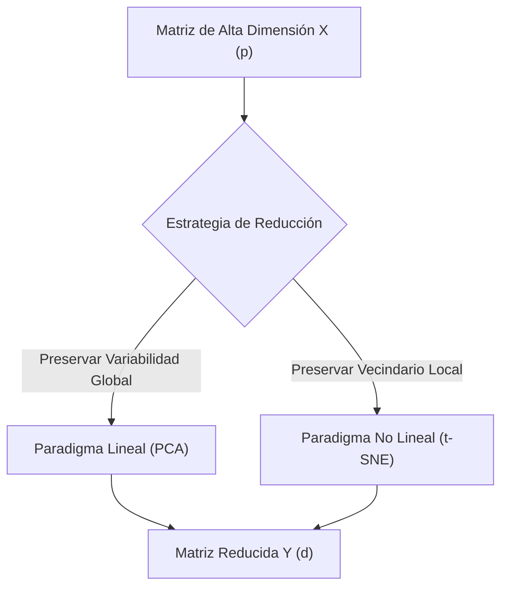

> [!abstract] Resumen
> 
> Fenómeno geométrico y estadístico donde el aumento de variables (_features_) provoca un crecimiento exponencial del volumen del hiperespacio. Esto genera una dispersión extrema de los datos (_sparsity_), invalidando las métricas de distancia local y provocando el colapso de algoritmos no paramétricos como [KNN](../ml/modelos_lineales_knn.md), mientras que los modelos estructurados globales como **RegresionLineal** exhiben una mayor resiliencia.

## 1. El Colapso del Vecindario Local

Los algoritmos basados en la métrica de distancia euclidiana operan bajo la premisa de vecindad local. Sin embargo, la densidad de los datos es inversamente proporcional a la dimensión del espacio:

- **Espacio de baja dimensionalidad (1D / 2D):** El volumen es reducido, lo que permite que los puntos muestrales permanezcan densamente empaquetados. Existe una alta probabilidad de encontrar vecinos genuinamente cercanos.
    
- **Espacio de alta dimensionalidad ($p \gg 2$):** El volumen del hiperespacio crece exponencialmente ($V \propto s^p$). Si el tamaño de la muestra ($n$) permanece constante, el espacio se vacía de manera asintótica.
    

Como consecuencia, la distancia matemática entre cualquier par de puntos se incrementa y converge hacia el mismo valor. El concepto de "vecino más cercano" pierde significado estadístico, ya que el algoritmo se ve obligado a tomar como referencia puntos que se encuentran vectorialmente remotos.

## 2. El Efecto Borde Geométrico

La intuición geométrica bidimensional falla al analizar hiperespacios. A medida que el número de dimensiones ($p$) tiende al infinito, el volumen de un hipercubo o hiperesfera se concentra casi en su totalidad en la corteza exterior (_boundary_).

> [!math-red] Teorema del Volumen Fronterizo
> 
> La fracción del volumen de un hipercubo de lado $1$ que se encuentra a una distancia $\epsilon$ de la frontera exterior está dada por:
> 
> $$ V_{\text{fronterizo}} = 1 - (1 - 2\epsilon)^p $$
> 
> Cuando $p \to \infty$, $V_{\text{fronterizo}} \to 1$, provocando que prácticamente la totalidad de los puntos muestrales se ubiquen en los límites extremos del espacio de características.

Esto altera radicalmente el comportamiento predictivo de los modelos:

## 3. Demostración Matemática: El Cubo Unitario

Para formalizar el impacto en la vecindad, consideramos un hipercubo unitario de dimensión $p$. Deseamos capturar una fracción de volumen fija ($f$) alrededor de un punto objetivo para consolidar un vecindario con suficientes datos históricos.

La longitud de la arista necesaria ($e$) para aislar dicha fracción de volumen se determina mediante la ecuación:

$$ e_p(f) = f^{1/p} $$

Si definimos un objetivo estándar de capturar el 10% del volumen de datos ($f = 0.10$), la variación de la arista necesaria según la dimensión del modelo se comporta de la siguiente manera:

|**Dimensión (p)**|**Expresión Matemática**|**Longitud de Arista (e)**|**Porcentaje del Rango Requerido**|
|---|---|---|---|
|**1D** ($p=1$)|$0.10^{1/1}$|$0.10$|$10\%$ (Estrictamente local)|
|**2D** ($p=2$)|$0.10^{1/2}$|$\approx 0.32$|$32\%$ (Pérdida localizada)|
|**10D** ($p=10$)|$0.10^{1/10}$|$\approx 0.79$|$79\%$ (Abarca casi todo el rango)|
|**100D** ($p=100$)|$0.10^{1/100}$|$\approx 0.98$|$98\%$ (Comportamiento global)|

> [!warning] Conclusión del Análisis de Volumen
> 
> En una dimensión de $p=10$, para examinar apenas el 10% de los datos circundantes, el algoritmo debe extenderse a lo largo del $80\%$ de la escala total de cada variable. El vecindario deja de ser local para convertirse en una búsqueda global, destruyendo la naturaleza del algoritmo estadístico.

## 4. Dicotomía de Modelado: KNN vs. Regresión Lineal

La resolución de la dimensionalidad determina la viabilidad de la arquitectura algorítmica elegida:

### Escenario A: Baja Dimensionalidad ($p$ bajo, $n$ alto)

Dominio de **$k$-NN**. Al disponer de una densidad muestral óptima en un volumen controlado, el modelo no paramétrico captura topologías complejas e irregulares sin sesgo predictivo.

### Escenario B: Alta Dimensionalidad ($p$ elevado)

Dominio de la **Regresión Lineal**. Los algoritmos geométricos locales colapsan debido a la dispersión. Los modelos lineales sobreviven en este entorno debido a su rigidez estructural:

> [!math-blue] Invarianza Estructural Lineal
> 
> La regresión lineal proyecta un hiperplano global parametrizado por un vector de pesos $\beta \in \mathbb{R}^{p+1}$:
> 
> $$ f(X) = \beta_0 + \sum_{j=1}^{p} \beta_j X_j $$
> 
> Esta estructura no calcula distancias relativas entre puntos individuales. Al asumir que la relación se extiende de forma continua e uniforme por todo el espacio, el hiperplano mantiene su consistencia asintótica guiándose por la tendencia global del sistema, independientemente de que los puntos de datos se encuentren aislados o marginados en los bordes.

# Técnicas de Reducción de Dimensionalidad (PCA y t-SNE) 

> [!abstract] Resumen
> 
> Análisis comparativo de los dos paradigmas principales para mitigar la Maldición de la Dimensionalidad: Análisis de Componentes Principales (PCA) como aproximación lineal global y t-Distributed Stochastic Neighbor Embedding (t-SNE) como aproximación no lineal probabilística local. Se detallan sus fundamentos matemáticos, mecanismos de proyección y criterios de aplicación.

## 1. El Paradigma de la Reducción Dimensional

Para contrarrestar la dispersión exponencial del hiperespacio ($V \propto s^p$), los algoritmos de reducción transforman una matriz de alta dimensionalidad $X \in \mathbb{R}^{n \times p}$ en una matriz de baja dimensionalidad $Y \in \mathbb{R}^{n \times d}$ (donde $d \ll p$).

La mitigación de la maldición se logra mediante dos vías conceptuales disjuntas:

## 2. PCA: Análisis de Componentes Principales (Enfoque Lineal Global)

PCA es un algoritmo determinista lineal que maximiza la varianza retenida mediante la proyección de los datos en un nuevo sistema de coordenadas ortogonales.

### Mecanismo Matemático

1. **Centrado de datos:** Se normaliza la matriz de diseño de forma que cada característica tenga media cero ($\mu = 0$).
    
2. **Matriz de Covarianza ($\Sigma$):** Se calcula la dispersión conjunta de las variables:
    
    $$ \Sigma = \frac{1}{n-1} X^T X \quad \text{donde } \Sigma \in \mathbb{R}^{p \times p} $$
    
3. **Descomposición Espectral:** Se obtienen los autovalores ($\lambda$) y autovectores ($v$) resolviendo la ecuación característica:
    
    $$ \Sigma v = \lambda v $$
    

> [!math-blue] Definición de Componente Principal
> 
> El autovector $v_1$ asociado al autovalor más alto $\lambda_1$ constituye la dirección de máxima varianza (Primer Componente Principal). Al ser $\Sigma$ una matriz simétrica real, todos los autovectores resultantes son estrictamente ortogonales entre sí, eliminando la multicolinealidad.

### Transformación Espacial

La proyección al subespacio latente se ejecuta mediante una transformación lineal pura:

$$ Y = X W_d $$

Donde $W_d \in \mathbb{R}^{p \times d}$ es la matriz de carga conteniendo los primeros $d$ autovectores.

## 3. t-SNE: t-Distributed Stochastic Neighbor Embedding (Enfoque Probabilístico Local)

t-SNE es un algoritmo no lineal y no determinista que convierte las distancias euclidianas entre puntos en probabilidades de afinidad condicional, minimizando la divergencia entre el hiperespacio y el espacio reducido.

### Definición de Probabilidades en Alta Dimensión ($X$)

La similitud del punto $x_j$ con el punto $x_i$ es la probabilidad condicional $p_{j|i}$, calculada bajo una distribución Gaussiana centrada en $x_i$:

$$ p_{j|i} = \frac{\exp(-\|x_i - x_j\|^2 / 2\sigma_i^2)}{\sum_{k \neq i} \exp(-\|x_i - x_k\|^2 / 2\sigma_i^2)} \implies p_{ij} = \frac{p_{j|i} + p_{i|j}}{2n} $$

La varianza de la Gaussiana ($\sigma_i^2$) se determina dinámicamente según el parámetro de _Perplejidad_ suministrado por el usuario.

### Definición de Probabilidades en Baja Dimensión ($Y$)

Para mapear los puntos en el espacio latente sin sufrir el problema de hacinamiento (_crowding problem_), t-SNE utiliza una distribución t-Student con un grado de libertad (equivalente a una distribución de Cauchy) para calcular las afinidades de los puntos proyectados $y_i, y_j$:

$$ q_{ij} = \frac{(1 + \|y_i - y_j\|^2)^{-1}}{\sum_{k} \sum_{l \neq k} (1 + \|y_k - y_l\|^2)^{-1}} $$

> [!math-red] El Escudo de la Distribución t-Student
> 
> Las colas pesadas de la distribución t-Student permiten que los puntos moderadamente distantes en el espacio original de alta dimensión se proyecten muy alejados en el espacio de baja dimensión, impidiendo que la masa de datos colapse en el centro del gráfico durante la optimización.

### Función de Pérdida y Optimización

La discrepancia entre las distribuciones de probabilidad $P$ y $Q$ se minimiza iterativamente utilizando el Descenso de Gradiente Estocástico (SGD) sobre la Divergencia de Kullback-Leibler:

$$ \mathcal{L}_{\text{KL}}(P || Q) = \sum_{i \neq j} p_{ij} \log \frac{p_{ij}}{q_{ij}} $$

## 4. Matriz Comparativa: PCA vs. t-SNE

|**Atributo / Criterio**|**PCA**|**t-SNE**|
|---|---|---|
|**Naturaleza Matemática**|Lineal, algebraica y determinista|No lineal, probabilística y estocástica|
|**Estructura Preservada**|Global (Grandes distancias, varianza total)|Local (Vecindarios próximos, _clusters_)|
|**Costo Computacional**|Bajo: $\mathcal{O}(p^3) + \mathcal{O}(p^2 n)$|Elevado: $\mathcal{O}(n^2)$ (Inviable para $n$ masivos)|
|**Determinismo**|Sí (Mismos datos producen idéntico output)|No (Sensible a la semilla aleatoria y perplejidad)|
|**Propósito Principal**|Ingeniería de variables, compresión y ML|Visualización de datos y descubrimiento de patrones|
|**Inversibilidad**|Sí ($X_{\text{approx}} = Y W_d^T$)|No (Mapeo destructivo, no paramétrico)|

## 5. Criterios de Selección Arquitectónica

> [!tip] Cuándo implementar PCA
> 
> - Como paso previo de preprocesamiento para algoritmos lineales (**RegresionLineal**, **RegresionLogistica**).
>     
> - Cuando se requiere reconstruir la señal original o proyectar nuevos datos en tiempo real (inferencia de producción).
>     
> - Si el volumen de observaciones ($n$) satura la memoria RAM del sistema de cómputo.
>     

> [!warning] Cuándo implementar t-SNE
> 
> - Exclusivamente para tareas de inspección visual en baja dimensionalidad (2D o 3D).
>     
> - Cuando las variables presentan dependencias altamente no lineales o estructuras topológicas en forma de variedades múltiples (_manifolds_).
>     
> - **Restricción:** Nunca debe usarse como una etapa de ingeniería de características para modelos de producción, ya que carece de una función de proyección explícita aplicable a nuevos vectores entrantes.
>