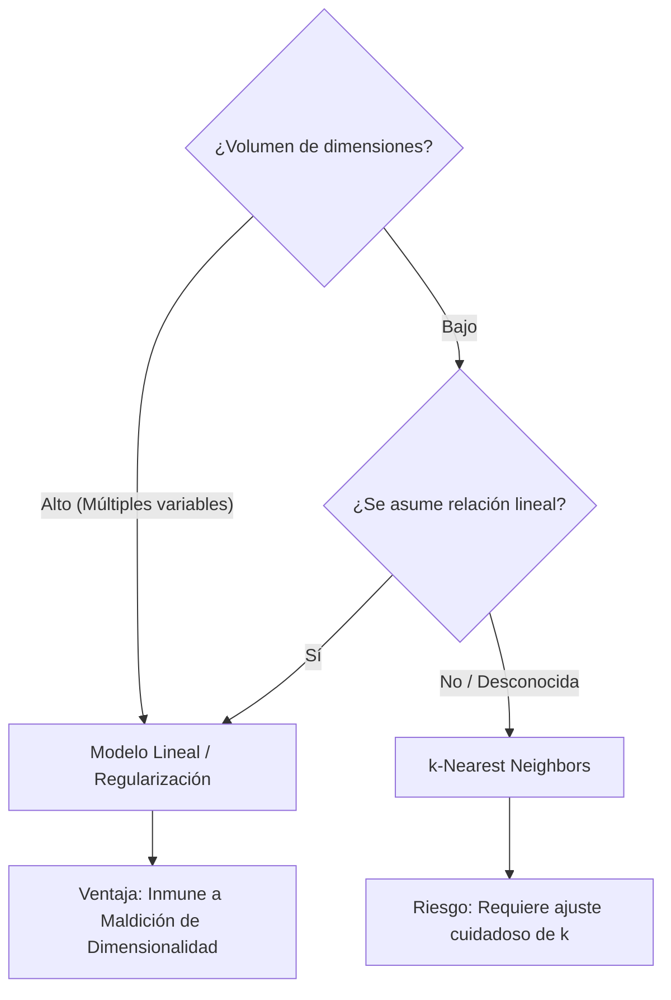

# Modelos Lineales vs k-Nearest Neighbors

> [!abstract] Propósito
> 
> Análisis de los conceptos fundamentales extraídos de _The Elements of Statistical Learning_ (ESL). Se contrasta el enfoque paramétrico rígido de los Modelos Lineales frente al enfoque no paramétrico y flexible de los Vecinos Más Cercanos ($k$-NN) para la predicción estadística.

## Modelos Lineales y Mínimos Cuadrados (Least Squares)

El modelo lineal es una herramienta paramétrica robusta que asume una relación estrictamente lineal (línea recta o hiperplano en múltiples dimensiones) entre las variables de entrada ($X$) y la variable de salida ($Y$).

> [!math-blue] Ecuación del Modelo Lineal
> 
> $$\hat{Y} = \hat{\beta}_0 + \sum_{i=1}^p X_i \hat{\beta}_i$$
> 
> - $\hat{Y}$: Predicción.
>     
> - $X_i$: Variables o _features_ de entrada (ej. retornos pasados, volumen, volatilidad).
>     
> - $\hat{\beta}_i$: Coeficientes o pesos asignados a cada variable.
>     
> - $\hat{\beta}_0$: Sesgo o intersección (_bias term_).
>     

Para determinar los mejores coeficientes $\beta$, el algoritmo minimiza la distancia al cuadrado entre las predicciones y los datos reales utilizando la métrica estadística óptima bajo el marco de la Función de Expectativa Condicional (CEF).

> [!math-red] Suma de Cuadrados de los Residuos (RSS)
> 
> $$RSS(\beta) = \sum_{i=1}^N (y_i - x_i^T \beta)^2$$

## Vecinos Más Cercanos ($k$-NN)

El algoritmo $k$-Nearest Neighbors es un enfoque no paramétrico extremo. No asume estructura subyacente ni entrena una función matemática estática; en su lugar, memoriza el conjunto de datos de entrenamiento en su totalidad.

> [!math-green] Ecuación $k$-NN
> 
> $$\hat{Y}(x) = \frac{1}{k} \sum_{x_i \in N_k(x)} y_i$$

Para generar una predicción, evalúa la distancia en el espacio de características, identifica los $k$ puntos históricos más cercanos a la condición actual ($X$), y promedia sus resultados ($Y$).

### Fronteras de Decisión y Complejidad (Parámetro $k$)

El comportamiento del modelo $k$-NN y la topología de sus fronteras de decisión están dictados por el valor de $k$, el cual define los grados de libertad efectivos del modelo ($N/k$).

- **$k=1$ (1-Nearest Neighbor)**: Genera una Teselación de Voronoi. Rodea cada punto con una frontera exclusiva, creando un mapa de decisión caótico e irregular. Aisla el ruido como "islas".
    
- **$k=15$ (15-Nearest Neighbor)**: El promedio entre 15 vecinos diluye el impacto del ruido individual. Las fronteras de decisión se suavizan, mejorando la generalización.
    

> [!warning] Sobreajuste (Overfitting)
> 
> Mantener un valor de $k=1$ resulta en sobreajuste puro, ya que el modelo captura el ruido estadístico como si fuera señal válida. A medida que $k$ aumenta, la complejidad del modelo disminuye drásticamente.

## El Compromiso Sesgo-Varianza (Bias-Variance Tradeoff)

La selección entre estos enfoques ilustra el compromiso fundamental del Machine Learning: la tensión entre sesgo y varianza.

|**Característica**|**Modelo Lineal (Least Squares)**|**k-Nearest Neighbors (k-NN)**|
|---|---|---|
|**Sesgo / Varianza**|**Alto Sesgo, Baja Varianza**: El modelo es estable ante nuevos datos, pero incapaz de adaptarse a estructuras no lineales.|**Bajo Sesgo, Alta Varianza**: Se adapta a cualquier forma compleja, pero es inestable frente a variaciones menores en los datos de entrenamiento.|
|**Supuestos**|Relación matemática estrictamente lineal.|Cero estructura subyacente asumida.|
|**Dimensionalidad**|Altamente eficiente. Procesa múltiples variables mediante álgebra matricial sin pérdida de rendimiento matemático.|Vulnerable a espacios de alta dimensión.|

> [!danger] La Maldición de la Dimensionalidad
> 
> Nunca aplicar $k$-NN en conjuntos de datos de alta dimensionalidad (ej. series temporales con >50 indicadores técnicos). En espacios altamente multidimensionales, la distancia euclidiana colapsa, volviendo equidistantes a todos los puntos y anulando la capacidad predictiva del algoritmo.

### Árbol de Decisión Arquitectónica

