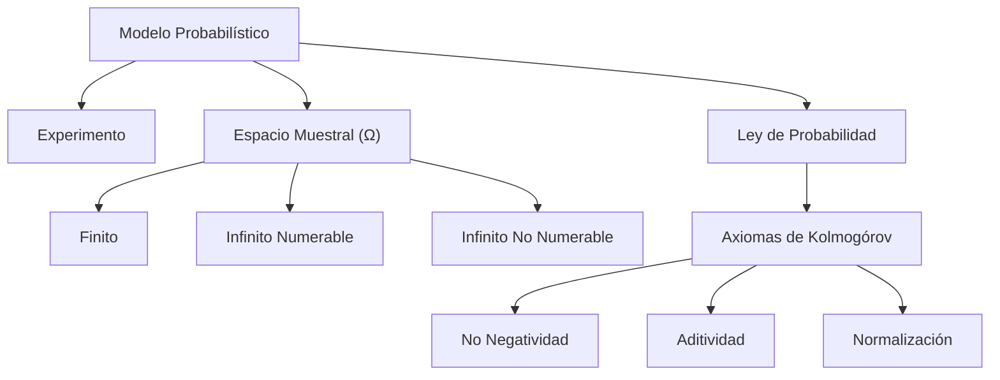

> [!abstract] Resumen
> 
> Los modelos probabilísticos son construcciones matemáticas diseñadas para analizar el comportamiento de sistemas y resolver problemas. Todo modelo de probabilidad se estructura sobre tres pilares: el **Experimento Probabilístico**, el **Espacio Muestral** y la **Ley de Probabilidad**.

## Componentes Fundamentales

### 1. El Experimento Probabilístico

Es el proceso subyacente que genera un resultado, el cual debe estar perfectamente definido dentro de los parámetros del modelo.

> [!example] Casos de uso
> 
> Lanzar una moneda, evaluar el sexo biológico del hermano de una persona o resolver el problema de las tres puertas (Monty Hall).

### 2. El Espacio Muestral (Ω)

Es el conjunto matemático que agrupa todos los resultados posibles de un experimento probabilístico. Depende de la "granularidad" o nivel de detalle requerido por la pregunta de negocio o investigación.

> [!danger] Condiciones Inquebrantables del Espacio Muestral
> 
> Todo conjunto válido como espacio muestral debe tener elementos que cumplan dos propiedades:
> 
> 1. **Mutuamente excluyentes**: Si ocurre un resultado, se tiene la certeza de que los demás no ocurrieron simultáneamente.
>     
> 2. **Colectivamente exhaustivos**: En su conjunto, los elementos cubren todas las posibilidades; todo resultado del experimento está incluido obligatoriamente.
>     

**Clasificación de Espacios Muestrales:**

- **Finitos**: Número limitado de resultados (ej. `{Cara, Cruz}`).
    
- **Infinitos numerables**: Infinitos resultados listables o asociables a números enteros (ej. cantidad de lanzamientos de moneda hasta obtener cara).
    
- **Infinitos no numerables**: Resultados en un rango continuo, generalmente números reales (ej. medir la distancia exacta de un dardo al centro).
    

### 3. Los Eventos

Un evento se define como cualquier subconjunto del **Espacio Muestral**.

- **Evento imposible**: Corresponde al conjunto vacío ($\emptyset$). Subconjunto de $\Omega$ que nunca ocurre.
- **Evento seguro**: Corresponde al espacio muestral completo ($\Omega$). Certeza absoluta de que algún resultado del experimento ocurrirá.
    
## Matemática Probabilística

### 4. Ley de Probabilidad y Axiomas de Kolmogórov (1933)

Mecanismo que asigna valores numéricos a cada evento. Estos números los define el diseñador del modelo, pero deben cumplir estrictamente los axiomas fundacionales.

> [!math-blue] Axiomas de Kolmogórov
> 
> 1. **No negatividad**: La probabilidad de cualquier evento siempre es mayor o igual a cero.
>     
>     $P(A) \geq 0$
>     
> 2. **Aditividad**: Si dos o más eventos son disjuntos (mutuamente excluyentes, intersección vacía), la probabilidad de su unión es la suma de sus probabilidades individuales.
>     
>     $P(A \cup B) = P(A) + P(B)$
>     
> 3. **Normalización**: La probabilidad del espacio muestral completo siempre es la unidad.
>     
>     $P(\Omega) = 1$
>     

### 5. Propiedades Derivadas

A partir de los tres axiomas de Kolmogórov, se demuestran lógicamente las siguientes reglas:

> [!math-green] Propiedades Matemáticas Derivadas
> 
> - **Probabilidad del conjunto vacío**:
>     
>     $P(\emptyset) = 0$
>     
> - **Límites de la probabilidad**:
>     
>     $0 \leq P(A) \leq 1$
>     
> - **Regla del complemento**:
>     
>     $P(A^c) = 1 - P(A)$
>     
> - **Regla general de la suma** (para eventos no disjuntos):
>     
>     $P(A \cup B) = P(A) + P(B) - P(A \cap B)$
>     
> - **Desigualdad de Boole** (Unión general):
>     
>     $P(A \cup B) \leq P(A) + P(B)$
>     
> - **Subconjuntos**: Si el evento $A$ es un subconjunto del evento $B$ ($A \subseteq B$), entonces:
>     
>     $P(A) \leq P(B)$
>