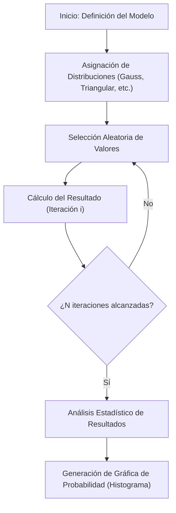

# Simulación de Montecarlo

> [!abstract] Propósito
> 
> La simulación de Montecarlo es un tipo de algoritmo computacional que utiliza un muestreo aleatorio repetido para obtener la probabilidad de que ocurra una serie de resultados.

## Concepto Central

La simulación se aleja de los modelos deterministas (que usan valores fijos) para adoptar un enfoque estocástico. Se utiliza cuando un sistema posee variables con alta volatilidad o dificultad de predicción.

> [!math-blue] Definición Probabilística
> 
> Sea $X$ una variable aleatoria con una distribución de probabilidad $P(X)$. La simulación de Montecarlo estima el valor esperado de una función $f(X)$ mediante la media aritmética de las evaluaciones de la función en muestras aleatorias extraídas de $P(X)$:
> 
> $$E[f(X)] \approx \frac{1}{N} \sum_{i=1}^{N} f(x_i)$$

## Proceso de Ejecución

El método opera mediante un ciclo iterativo de cuatro etapas principales:

Independientemente de la herramienta que utilice, las técnicas de **Montecarlo** constan de tres pasos básicos:

1. Configure el modelo predictivo, identificando tanto la variable dependiente que debe predecirse como las variables independientes (también conocidas como variables de entrada, de riesgo o predictoras) que impulsarán la predicción.

2. Especifique distribuciones de probabilidad de las variables independientes. Utilizar datos históricos y/o el juicio subjetivo del analista para definir una gama de valores probables y asignar pesos de probabilidad a cada uno.

3. Ejecute simulaciones de manera repetida, generando valores aleatorios de las variables independientes. Haga esto hasta que se reúnan suficientes resultados para formar una muestra representativa del número casi infinito de combinaciones posibles.

Puede realizar tantas simulaciones **Montecarlo** como desee modificando los parámetros subyacentes que utiliza para simular los datos. Sin embargo, también querrá calcular el rango de variación dentro de una muestra mediante el cálculo de la varianza y la desviación típica, que son medidas de dispersión utilizadas habitualmente. La varianza de una variable dada es el valor esperado de la diferencia al cuadrado entre la variable y su valor esperado. La desviación típica es la raíz cuadrada de la varianza. Normalmente, las variaciones más pequeñas se consideran mejores.

## Ejemplo Práctico: Presupuesto de Construcción

En la gestión de proyectos, como la construcción de un puente, las variables no son estáticas:

- **Acero**: Variación de precio entre $100 y $150.
    
- **Mano de obra**: Duración estimada entre 10 y 15 meses.
    
- **Clima**: Retrasos potenciales de 0 a 30 días.
    

> [!example] Resultado de la Simulación
> 
> En lugar de una cifra única, el análisis arroja una **Distribución Acumulada**. El gestor puede determinar que:
> 
> - Existe un **15%** de probabilidad de terminar por debajo del presupuesto base.
>     
> - Existe un **90%** de certeza de que el costo no superará los 1.2 millones.
>     

## Aplicaciones Industriales

|**Sector**|**Uso Principal**|
|---|---|
|**Finanzas**|Valoración de opciones, análisis de riesgo de carteras y predicción de mercado.|
|**Ingeniería**|Pruebas de fiabilidad, resistencia de materiales y tolerancia de componentes.|
|**Gestión de Proyectos**|Estimación de cronogramas (PERT/Montecarlo) y presupuestos de contingencia.|
|**Ciencia**|Modelado de colisiones moleculares, física de partículas y epidemiología.|

> [!tip] Recomendación
> 
> Para obtener resultados estadísticamente significativos en modelos complejos, se recomienda realizar un mínimo de 10,000 iteraciones para reducir el error estándar de la media.