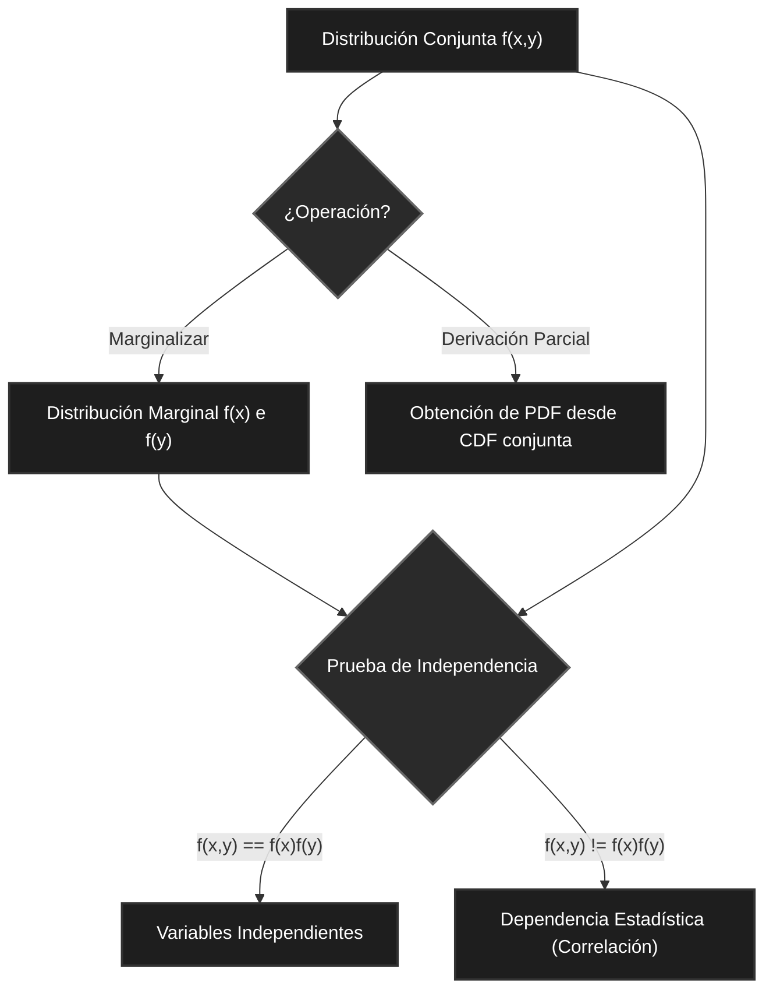

# Variables Aleatorias y Distribuciones Conjuntas

> [!abstract] Resumen
> 
> Mecánica matemática fundamental para operar con múltiples variables aleatorias y transformar variables existentes. Constituye la base teórica del cálculo estocástico multidimensional.

## 1. Transformación de Variables Aleatorias ($Y = g(X)$)

Define el método para obtener la distribución de una variable $Y$ que es función directa de una variable $X$ con distribución conocida.

> [!warning] Condición Estricta
> 
> La función $g(x)$ debe ser **estrictamente creciente** (o decreciente). Esto asegura que la función sea biyectiva, garantizando la existencia de su inversa matemática $g^{-1}(x)$.

### Explicación sencilla

La transformación de variables ($Y = g(X)$).

Para entenderlo, no pienses en finanzas todavía. Piensa en **temperaturas**.

> [!math-blue] Teorema de Transformación
> 
> **Paso 1: Igualación de CDFs**
> 
> La probabilidad de que $Y \leq a$ equivale a la probabilidad de que $X$ sea menor o igual a la preimagen de $a$:
> 
> $$F_Y(a) = P(Y \leq a) = P(g(X) \leq a) = P(X \leq g^{-1}(a)) = F_X(g^{-1}(a))$$
> 
> **Paso 2: Derivación para PDF**
> 
> Para obtener la Función de Densidad de Probabilidad ($f_Y(a)$), se aplica la regla de la cadena derivando la CDF ($F_Y(a)$) respecto a $a$.

### El Problema

Imagina que eres un meteorólogo en España. Conoces perfectamente cómo se comporta la temperatura en tu ciudad en grados **Celsius ($X$)**. Sabes la probabilidad exacta de que mañana haga 20ºC, 25ºC o 30ºC.

De repente, te contrata una cadena de televisión de Estados Unidos. Te piden que les des las probabilidades, pero en **Fahrenheit ($Y$)**.

Tú no tienes datos históricos en Fahrenheit. Tu variable original es $X$ (Celsius). Necesitas crear una variable nueva $Y$ (Fahrenheit). Sabes que la fórmula para pasar de uno a otro es multiplicar por 1.8 y sumar 32.

Esa fórmula es tu $g(X)$.
#### 1. El requisito: "Strictly increasing" (Estrictamente creciente)

El texto dice que $g(x)$ debe ser una función estrictamente creciente. ¿Por qué te exigen esto?

Porque necesitas que la fórmula tenga **"marcha atrás"** (lo que en matemáticas se llama función inversa, $g^{-1}$).

- Si metes 10ºC en la fórmula, salen 50ºF.
- Como la línea siempre sube (es estrictamente creciente), si te dicen "hacen 50ºF", tú puedes hacer la cuenta al revés y asegurar al 100% que eran 10ºC.
    
Si la función subiera y bajara como una montaña rusa, un valor de $Y$ (ej. 50ºF) podría provenir de varios valores distintos de $X$. Si eso pasa, no puedes rastrear el origen y las matemáticas de la probabilidad explotan.

#### 2. La fórmula de la CDF: $F_Y(a) = F_X(g^{-1}(a))$

Esta ecuación parece intimidante, pero lo único que dice es una perogrullada lógica:

> **"La probabilidad de que mañana haga menos de 50 Fahrenheit es EXACTAMENTE LA MISMA que la probabilidad de que haga menos de 10 Celsius."**

- $F_Y(a)$: La probabilidad acumulada de que los Fahrenheit sean menores a 50.
- $F_X(\text{...})$: La probabilidad acumulada de los Celsius originales.
- $g^{-1}(a)$: La "marcha atrás" que convierte el objetivo (50ºF) de vuelta a su origen (10ºC) para que puedas buscar la probabilidad en tu base de datos original.
    

Simplemente estás tomando el % de probabilidad que ya conocías de la variable $X$, y se lo estás asignando a la nueva variable $Y$.

## 2. Distribuciones Conjuntas (Joint Distributions)

Modelan la probabilidad en espacios multidimensionales (dos o más variables simultáneas, aplicable a modelos de correlación de activos financieros).

> [!math-purple] Definiciones Multidimensionales
> 
> **Discreto (PMF - Función de Masa de Probabilidad):**
> 
> $$p_{X,Y}(x,y) = P(X=x, Y=y)$$
> 
> Probabilidad exacta de la ocurrencia simultánea de eventos discretos.
> 
> **Continuo (CDF - Función de Distribución Acumulada):**
> 
> $$F_{X,Y}(x,y) = P(X \leq x, Y \leq y)$$
> 
> Probabilidad acumulada en un área o volumen.
> 
> **Continuo (PDF - Función de Densidad de Probabilidad):**
> 
> $$f_{X,Y}(x,y) = \frac{\partial^2 F_{X,Y}(x,y)}{\partial x \partial y}$$
> 
> Densidad puntual obtenida aplicando derivadas parciales de segundo orden sobre la CDF.

## 3. Distribuciones Marginales

Proceso matemático para aislar el comportamiento de una variable, eliminando la influencia del resto del sistema (equivalente a proyectar un objeto 3D en un plano 2D). Requiere evaluar la distribución conjunta a través de todos los valores posibles de la variable a descartar.

> [!math-orange] Operaciones de Marginalización
> 
> **Variables Discretas (Sumatoria):**
> 
> $$p_X(x) = \sum_y p_{X,Y}(x,y)$$
> 
> **Variables Continuas (Integración):**
> 
> $$f_X(x) = \int_y f_{X,Y}(x,y) dy$$

## 4. Independencia Estadística

Establece la prueba matemática concluyente para determinar si existe relación entre dos variables. Si no se cumple esta igualdad, existe dependencia estadística y es posible cuantificar su **correlación**.

> [!math-red] Axioma de Independencia
> 
> Dos variables $X$ e $Y$ son totalmente independientes si y solo si su distribución conjunta es idéntica al producto de sus distribuciones marginales aisladas:
> 
> $$f_{X,Y}(x,y) = f_X(x)f_Y(y)$$

---

## Flujo Lógico de Operaciones Estocásticas

