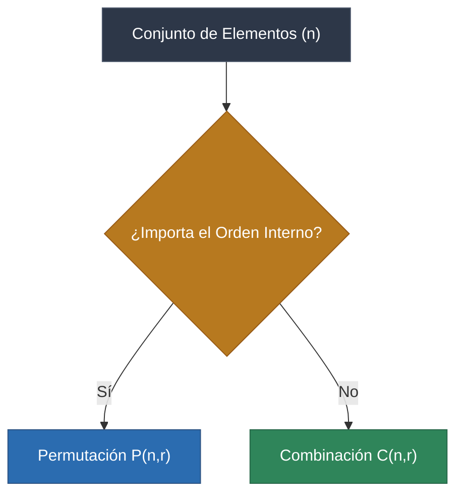

> [!abstract] Propósito
> 
> Definir y estructurar la diferencia matemática entre permutaciones y combinaciones. La divergencia conceptual y de cálculo entre ambas métricas probabilísticas depende de una única restricción: **la importancia del orden de los elementos**.

Fragmento de código

## 1. Permutaciones (El Orden SÍ Importa)

En una permutación, la disposición o secuencia de los elementos seleccionados altera el resultado final. El subconjunto `[A, B, C]` se considera un evento completamente distinto al subconjunto `[C, B, A]`.

> [!warning] El Antipatrón del "Candado"
> 
> Coloquialmente se utiliza el término "combinación de un candado". Matemáticamente, esto es erróneo. Dado que el candado requiere una secuencia exacta (ej. 4-7-2 no es igual a 7-2-4), el término correcto es **permutación**.

> [!math-blue] Fórmula de la Permutación (Sin repetición)
> 
> Cuantifica de cuántas formas específicas se pueden ordenar $r$ elementos extraídos de un conjunto total de $n$ elementos.
> 
> $$P(n, r) = \frac{n!}{(n - r)!}$$
> 
> Donde:
> 
> - $n$: Número total de elementos disponibles.
>     
> - $r$: Número de elementos seleccionados.
>     
> - $!$: Factorial (el producto de todos los enteros positivos menores o iguales al número).
>     

> [!example] Caso de Uso: Cargos Directivos
> 
> Se requiere elegir Presidente, Vicepresidente y Secretario ($r=3$) entre 5 candidatos ($n=5$).
> 
> $$P(5, 3) = \frac{5!}{(5 - 3)!} = \frac{5!}{2!} = \frac{120}{2} = 60 \text{ formas distintas.}$$

## 2. Combinaciones (El Orden NO Importa)

En una combinación, el orden interno de los elementos seleccionados es irrelevante; lo único que importa es su presencia en el subconjunto. El grupo `[A, B, C]` es idéntico al grupo `[C, B, A]`.

> [!math-green] Fórmula de la Combinación (Sin repetición)
> 
> Al no importar el orden, se divide la fórmula de las permutaciones por $r!$ para eliminar los casos redundantes (el mismo grupo desordenado).
> 
> $$C(n, r) = \frac{n!}{r!(n - r)!}$$

> [!example] Caso de Uso: Selección de Equipo
> 
> Se requiere elegir 3 empleados ($r=3$) entre 5 candidatos ($n=5$) para un viaje de negocios sin distinción de roles.
> 
> $$C(5, 3) = \frac{5!}{3!(5 - 3)!} = \frac{120}{6 \times 2} = \frac{120}{12} = 10 \text{ grupos distintos.}$$

## 3. Matriz Comparativa

Análisis de un espacio muestral reducido: Seleccionar 2 elementos de un total de 3 {A, B, C}.

|**Variable**|**Permutación**|**Combinación**|
|---|---|---|
|**Condición del Orden**|SÍ altera el resultado|NO altera el resultado|
|**Resultados Posibles**|AB, BA, AC, CA, BC, CB|AB, AC, BC|
|**Frecuencia Resultante**|6 iteraciones|3 iteraciones|
|**Lógica**|"AB" y "BA" son conjuntos distintos|"AB" y "BA" son el mismo conjunto|

---

# Combinatoria con Repetición

> [!abstract] Propósito
> 
> Definir la lógica matemática y las fórmulas aplicables cuando la extracción de elementos permite repetición (reemplazo). La regla de decisión principal sigue siendo la relevancia del orden interno de los elementos seleccionados.

## 1. Permutaciones con Repetición (El Orden SÍ Importa)

Este escenario asume un conjunto de opciones donde un mismo elemento puede elegirse múltiples veces y la secuencia temporal o posicional de elección genera eventos distintos (ej. "1-1-2" $\neq$ "1-2-1").

> [!math-blue] Fórmula de Permutación con Repetición
> 
> Basada en lógica multiplicativa pura, donde en cada iteración se dispone del conjunto total de elementos.
> 
> $$P_{rep}(n, r) = n^r$$
> 
> **Donde:**
> 
> - $n$: Número de opciones disponibles en cada paso.
>     
> - $r$: Número de posiciones o iteraciones a completar.
>     

> [!example] Caso de Uso: Candado Numérico
> 
> Se requiere configurar un candado de 3 posiciones ($r = 3$) utilizando dígitos del 0 al 9 ($n = 10$).
> 
> $$P_{rep}(10, 3) = 10^3 = 1000 \text{ combinaciones posibles.}$$

## 2. Combinaciones con Repetición (El Orden NO Importa)

Permite seleccionar un mismo elemento múltiples veces, pero el orden de extracción es irrelevante. Matemáticamente, se resuelve mediante el teorema de "Estrellas y Barras" (Stars and Bars), transformando el problema en una combinación estándar sin repetición mediante un ajuste de variables.

> [!math-green] Fórmula de Combinación con Repetición
> 
> $$C_{rep}(n, r) = \frac{(n + r - 1)!}{r!(n - 1)!}$$

> [!example] Caso de Uso: Selección en Heladería
> 
> Se requiere elegir 3 bolas de helado ($r = 3$) de un expositor con 4 sabores disponibles ($n = 4$). La repetición de sabores está permitida y el orden en la tarrina no altera el producto final.
> 
> $$C_{rep}(4, 3) = \frac{(4 + 3 - 1)!}{3!(4 - 1)!} = \frac{6!}{3! \times 3!} = \frac{720}{36} = 20 \text{ agrupaciones posibles.}$$

## 3. Cuadrante de Escenarios Combinatorios

La siguiente tabla resume el marco de decisión completo de la **Combinatoria Basica**:

|**Escenario**|**¿Importa el orden?**|**¿Se puede repetir?**|**Fórmula**|**Ejemplo Clásico**|
|---|---|---|---|---|
|**Permutación Normal**|SÍ|NO|$\frac{n!}{(n - r)!}$|Podio de carrera (Oro, Plata, Bronce)|
|**Permutación con Repetición**|SÍ|SÍ|$n^r$|Contraseñas o PIN bancario|
|**Combinación Normal**|NO|NO|$\frac{n!}{r!(n - r)!}$|Elegir a 3 personas de un grupo de 10|
|**Combinación con Repetición**|NO|SÍ|$\frac{(n + r - 1)!}{r!(n - 1)!}$|Tarrina de helado (mismos sabores permitidos)|
