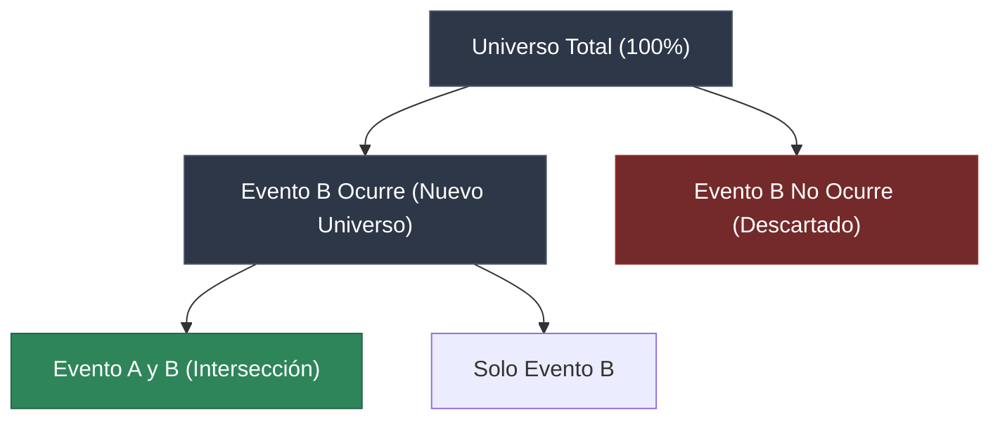
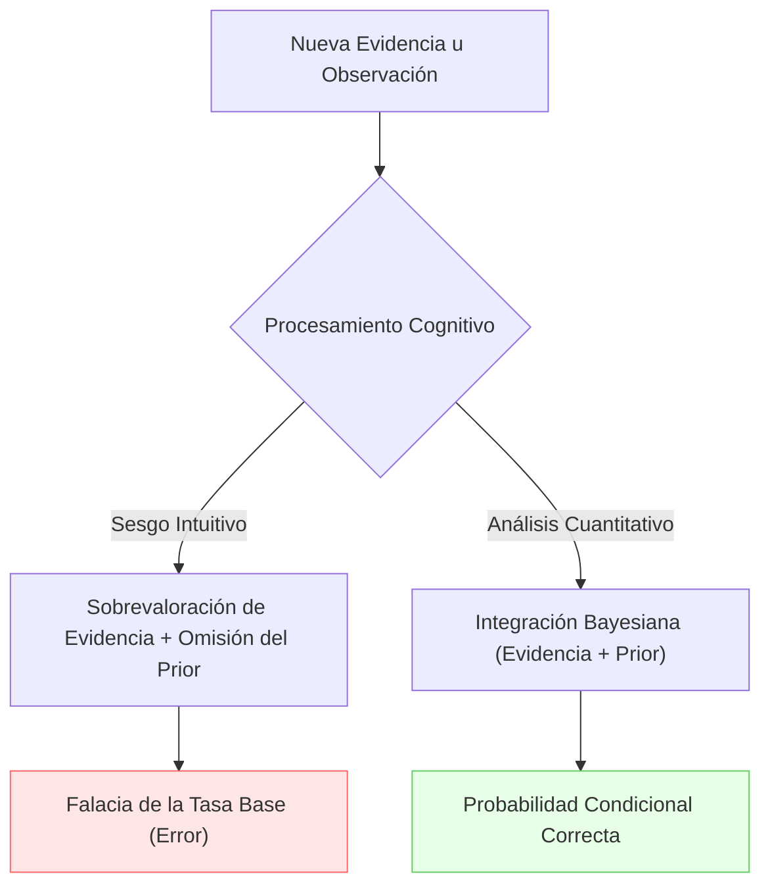

> [!abstract] Propósito
> 
> La probabilidad condicional permite cuantificar la ventaja estadística (edge) de una señal o indicador, evaluando la probabilidad de un evento (ej. subida del precio) sabiendo que otro evento previo (ej. cruce de medias) ya ha ocurrido. Se pasa de operar con probabilidades absolutas a probabilidades filtradas por condiciones de mercado.

## 1. Definición y Fórmula Matemática

> [!math-blue] Probabilidad Condicional $P(A|B)$
> 
> La probabilidad de que ocurra el evento $A$, dado que el evento $B$ ha ocurrido, se define como:
>
$$P(A \cap B) = \frac{\text{Número de veces que ocurren A y B}}{\text{Total de datos (N)}}$$
>
> 
> $$P(A|B) = \frac{P(A \cap B)}{P(B)}$$
> 
> **Donde:**
> 
> - $P(A|B)$: Probabilidad condicional de $A$ dado $B$.
>     
> - $P(A \cap B)$: Probabilidad conjunta (intersección de $A$ y $B$).
>     
> - $P(B)$: Probabilidad marginal del evento $B$ ($P(B) > 0$).
>     

### 1.1. Reducción del Espacio Muestral

El concepto central radica en la reducción del universo de posibilidades. Al confirmar la ocurrencia del evento $B$, se descarta el resto del universo de datos. El nuevo denominador de la ecuación pasa a ser exclusivamente $P(B)$.

Fragmento de código

## 2. Aplicación Práctica

> [!example] Ejemplo 1: Probabilidad Clásica (Dado)
> 
> Universo: Dado de 6 caras.
> 
> - **Evento A**: Sacar un 2. ($P(A) = 1/6 \approx 16.6\%$)
>     
> - **Evento B**: El número es par {2, 4, 6}. ($P(B) = 3/6 = 50\%$)
>     
> 
> Cálculo condicional $P(A|B)$:
> 
> $$P(A|B) = \frac{1/6}{3/6} = \frac{1}{3} \approx 33.3\%$$
> 
> La información de $B$ altera drásticamente la probabilidad de $A$.

> [!example] Ejemplo 2: Señales de Trading Cuantitativo
> 
> Historial de validación de un indicador técnico (100 días):
> 
> - **Días Totales**: 100
>     
> - **Precio SUBIÓ ($Sube$)**: 55 ($P(Sube) = 55\%$)
>     
> - **Indicador dio COMPRA ($Compra$)**: 30 ($P(Compra) = 30\%$)
>     
> - **Precio SUBIÓ y dio COMPRA ($Sube \cap Compra$)**: 21
>     
> 
> Cálculo de la probabilidad de éxito de la señal $P(Sube|Compra)$:
> 
> $$P(Sube|Compra) = \frac{0.21}{0.30} = 0.70$$
> 
> **Conclusión:** El mercado tiene una probabilidad base de subida del 55%. Al condicionarlo a la señal de compra, la probabilidad aumenta al 70%. Existe ventaja estadística.

# Falacia de la Tasa Base

> [!abstract] Resumen
> 
> La Falacia de la Tasa Base (Base Rate Fallacy), documentada por Daniel Kahneman y Amos Tversky, es un sesgo cognitivo que demuestra cómo los humanos sobrevaloran la "nueva evidencia" (testigos, pruebas médicas, estereotipos) y omiten sistemáticamente la "probabilidad base o histórica" (el **Prior**).

> [!math-blue] Intervención Bayesiana
> 
> Las firmas cuantitativas evalúan este sesgo para garantizar que el razonamiento estadístico y el Teorema de Bayes prevalezcan sobre la intuición biológica.
> 
> $$P(A|B) = \frac{P(B|A) \cdot P(A)}{P(B)}$$
>
> "The evidence term in Bayes’ theorem is often calculated with the law of total probability using A and its complement ¬A, i.e. we can write P (B) = P (B|A)P (A) + P (B|¬A)P (¬A)"

## Casos de Estudio Cuantitativo

### 1. El Misterio del Taxi Azul (El Peso de la Mayoría)

> [!warning] Trampa Intuitiva
> 
> Un testigo con un 80% de agudeza visual identifica un taxi azul. La intuición asigna un 80% de probabilidad al evento empírico, ignorando la distribución del entorno.

El 85% de los taxis en la ciudad son verdes. La densidad masiva de la probabilidad base magnifica el margen de error del testigo (20% de falsos positivos).

> [!example] Desglose Numérico (Muestra Base de 100 Taxis)
> 
> - **Población Mayoritaria (85 Verdes)**: El testigo se equivoca en el 20%. Señala erróneamente **17** taxis verdes como azules.
>     
> - **Población Minoritaria (15 Azules)**: El testigo acierta en el 80%. Señala correctamente **12** taxis azules.
>     
> - **Total de Identificaciones "Azul"**: $17 + 12 = 29$
>     
> - **Probabilidad Real**: $\frac{12}{29} \approx 41\%$
>     
>     Conclusión: Es estadísticamente más probable que el taxi implicado fuera verde.
>     

### 2. Steve: ¿Bibliotecario o Granjero?

> [!warning] Trampa Intuitiva
> 
> Una descripción de personalidad (tímido, ordenado) encaja perfectamente con el estereotipo del bibliotecario, eclipsando la demografía ocupacional real.

La probabilidad base dicta que existe una proporción de 20:1 a favor de los granjeros frente a los bibliotecarios.

> [!example] Impacto del Tamaño de Muestra
> 
> - **Demografía**: 20,000 granjeros vs. 1,000 bibliotecarios.
>     
> - **Segmento Tímido Bibliotecarios** (Asumiendo 40%): 400 individuos.
>     
> - **Segmento Tímido Granjeros** (Asumiendo 10%): 2,000 individuos.
>     
>     Conclusión: Seleccionando un individuo tímido al azar, existe una probabilidad 5 veces mayor (2000 vs 400) de que pertenezca a la clase demográfica dominante (granjero).
>     

### 3. El Test de Ébola (Paradoja de Falsos Positivos)

> [!warning] Trampa Intuitiva
> 
> Ante una prueba médica con 99% de precisión, un resultado positivo induce a asumir una probabilidad del 99% de padecer la enfermedad.

La prevalencia de la enfermedad en la población general es extremadamente baja (1%). Esta abrumadora mayoría de personas sanas genera un volumen de falsos positivos que compite directamente con los verdaderos positivos.

> [!example] Desglose Numérico (Muestra de 10,000 individuos)
> 
> - **Población Infectada (100)**: La prueba detecta 99 (Verdadero Positivo).
>     
> - **Población Sana (9,900)**: La prueba falla el 1%, marcando 99 (Falso Positivo).
>     
> - **Total de Positivos**: 198 resultados.
>     
> - **Probabilidad Real (Un Test)**: $\frac{99}{198} = 50\%$
>     

> [!tip] El Poder de la Confirmación (Actualización del Prior)
> 
> Si un segundo test arroja un resultado positivo, la probabilidad sube al 99%. La razón radica en que el Prior para esta segunda evaluación ya no es el 1% de la población general, sino el 50% derivado de la primera evidencia.

### 4. Las 1000 Monedas (Filtrado Cuantitativo)

Este es el ejercicio estándar para discriminar perfiles analíticos durante entrevistas algorítmicas.

**Escenario:** 999 monedas normales, 1 moneda trucada (doble cara). Se extrae una al azar, se lanza 10 veces y resultan 10 caras.

> [!danger] Trampa Intuitiva
> 
> La imposibilidad percibida de obtener 10 caras consecutivas con una moneda normal empuja al cerebro a dictaminar la selección de la moneda trucada con casi total certeza.

El razonamiento cuantitativo puro evalúa la colisión de dos anomalías estadísticas frente a frente.

> [!math-purple] Equilibrio de Anomalías
> 
> - **Anomalía A (El Prior)**: Extraer la moneda trucada del total es $\frac{1}{1000}$.
>     
> - **Anomalía B (La Evidencia)**: Obtener 10 caras consecutivas con una moneda normal es $\left(\frac{1}{2}\right)^{10} = \frac{1}{1024}$.
>     
>     Conclusión: Al converger ambas probabilidades en valores casi idénticos ($\approx \frac{1}{1000}$), el peso del evento se equilibra. La probabilidad real es aproximadamente del 50% para la moneda trucada y 50% para una racha estadística extrema de una moneda normal.

