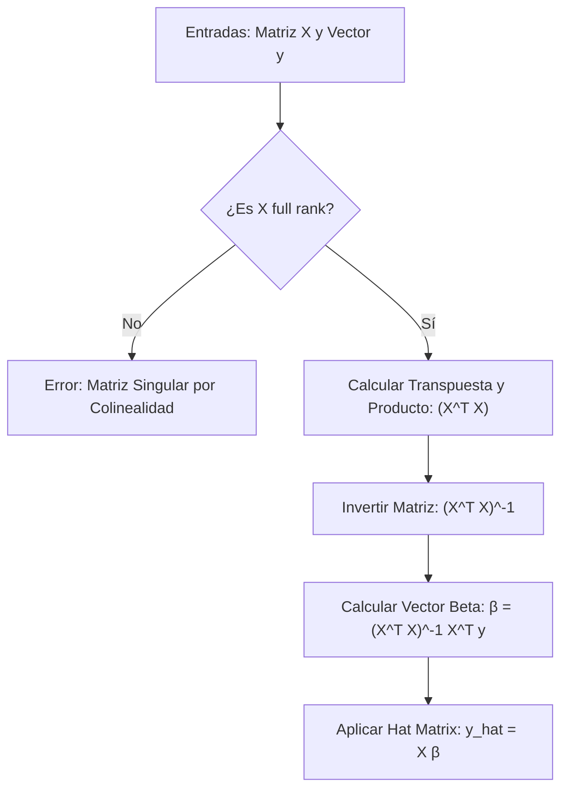

> [!abstract]
> 
> Define la base matemática estricta y el álgebra lineal subyacente para entrenar modelos predictivos mediante matrices en **RegresionLineal**, permitiendo encontrar los coeficientes óptimos de forma analítica.

## 1. Solución Cerrada (Closed Form)

La solución cerrada permite calcular los pesos o coeficientes óptimos ($\hat{\beta}$) de un modelo predictivo directamente, resolviendo el sistema matricial sin necesidad de emplear algoritmos iterativos como el **DescensoDeGradiente**.

> [!math-blue] Ecuación Óptima de Coeficientes
> 
> $$\hat{\beta} = (X^T X)^{-1} X^T y$$

- **$X$**: Matriz de características (las filas son datos históricos, las columnas son variables predictoras).
- **$y$**: Vector con los valores objetivo reales.
- **$X^T$**: Matriz transpuesta de $X$.
- **$(X^T X)^{-1}$**: Inversa de la matriz cuadrada resultante del producto.

## 2. Derivación Matemática

El objetivo fundamental es minimizar el error, definido estadísticamente como la Suma de Cuadrados de los Residuos ($RSS$).

> [!math-green] Suma de Cuadrados de los Residuos (RSS)
> 
> $$RSS = (y - X\beta)^T (y - X\beta)$$

Para encontrar el punto mínimo de la curva de error, se aplica cálculo diferencial: se deriva respecto al vector $\beta$ y se iguala a cero. Esto produce las denominadas **Ecuaciones Normales**:

> [!math-red] Derivada y Ecuaciones Normales
> 
> $$\frac{\partial RSS}{\partial \beta} = -2X^T (y - X\beta) = 0$$

Al despejar $\beta$ de este sistema matricial, se obtiene exactamente la fórmula de la solución cerrada descrita en el punto anterior.

## 3. Matriz Sombrero (Hat Matrix)

Una vez entrenado el modelo con $\hat{\beta}$, se generan las predicciones $\hat{y}$ multiplicando los datos de entrada $X$ por los pesos optimizados:

> [!math] Ecuación Base de Predicción
> 
> $$\hat{y} = X \hat{\beta}$$

Si se sustituye $\hat{\beta}$ por su desarrollo analítico completo, se revela el operador de proyección:

> [!math-purple] Hat Matrix ($H$)
> 
> $$\hat{y} = \left[ X(X^T X)^{-1} X^T \right] y$$

> [!info] Proyección Ortogonal
> 
> El bloque matricial entre corchetes es la matriz $H$ (Hat Matrix). Geométricamente, $H$ actúa como un operador de proyección ortogonal que "aplasta" el vector multidimensional $y$ original para que encaje como una sombra exacta sobre el plano o subespacio generado por las variables $X$.

## 4. Colapso por Colinealidad

Al programar o implementar estos modelos a nivel código, existe un punto crítico de fallo directamente relacionado con las propiedades de las matrices.

> [!danger] Matriz Singular y Pérdida de Rango
> 
> Para calcular la solución cerrada, la matriz $X$ debe tener **rango completo (full rank)**. Esto requiere independencia lineal absoluta entre todas las columnas (variables).

Si se introducen dos variables perfectamente correlacionadas (colinealidad perfecta, ej. precio en dólares y su conversión exacta a euros), ocurre un fallo algebraico:

1. **Redundancia Matemática**: Una columna se vuelve dependiente de otra.
    
2. **Determinante Cero**: El determinante de la matriz $(X^T X)$ se vuelve $0$.
    
3. **Matriz Singular**: Resulta matemáticamente imposible calcular su inversa $(X^T X)^{-1}$, equivalente a un intento de división por cero.
    
4. **Fallo de Ejecución**: El algoritmo lanza un error, ya que no existe un criterio matemático para repartir el peso $\hat{\beta}$ entre dos variables que aportan idéntica información.
    

## 5. Flujo de Ejecución del Algoritmo

