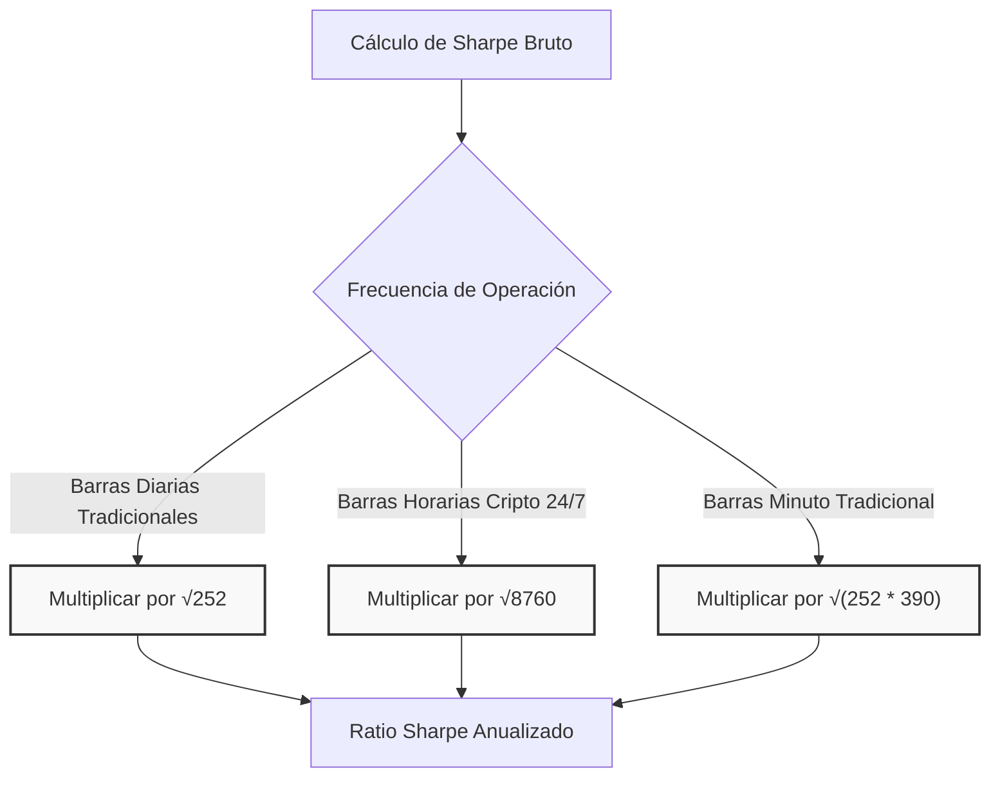

> [!abstract] Definición
> 
> El **Ratio Sharpe** es la métrica estándar en finanzas cuantitativas para evaluar el rendimiento ajustado al riesgo. Cuantifica el exceso de rentabilidad generado por una estrategia de trading o portafolio de inversión por cada unidad de volatilidad (riesgo) asumida.

---

## 1. Fundamento Matemático

El ratio aísla el rendimiento real atribuible al algoritmo, descartando el retorno que el mercado ofrece de forma garantizada ("libre de riesgo").

> [!math-blue] Fórmula del Ratio Sharpe
> 
> $$S = \frac{R_p - R_f}{\sigma_p}$$
> 
> Donde:
> 
> - $R_p$: Retorno esperado o histórico de la estrategia.
>     
> - $R_f$: Tasa libre de riesgo (retorno garantizado del mercado, como bonos del Tesoro).
>     
> - $\sigma_p$: Desviación estándar de los retornos (volatilidad total).
>     

---

## 2. Interpretación en Backtesting Institucional

La evaluación de la viabilidad de un modelo cuantitativo se mide por la magnitud de su Sharpe anualizado.

| **Valor Sharpe Anualizado** | **Calificación** | **Interpretación**                                            |
| --------------------------- | ---------------- | ------------------------------------------------------------- |
| **< 1.0**                   | Deficiente       | Riesgo excesivo para el retorno. Inferior a inversión pasiva. |
| **1.0 - 1.5**               | Aceptable        | Viable para _trend following_ o estrategias de largo plazo.   |
| **1.5 - 2.0**               | Excelente        | Rango objetivo estándar para _hedge funds_ cuantitativos.     |
| **> 3.0**                   | Sospechoso       | Probable error metodológico en fase de _research_.            |

> [!danger] Falsos Positivos en Research
> 
> En el 99% de los casos en simulaciones de [Backtesting](../strategies/backtesting.md), un Sharpe superior a 3.0 no indica una estrategia revolucionaria, sino un error de código, _Overfitting_ masivo o una grave filtración de datos futuros (**LookAheadBias**).

---

## 3. Limitaciones y Puntos Ciegos

El Ratio Sharpe presenta deficiencias matemáticas que deben neutralizarse en el diseño de motores de validación.

### A. Penalización de la Volatilidad al Alza

Utiliza la desviación estándar total ($\sigma_p$), lo que significa que un salto brusco de ganancias masivas es procesado estadísticamente como "riesgo", reduciendo la puntuación general.

> [!tip] Solución
> 
> Emplear el [RatioSortino](../portfolio/sortino_ratio.md), el cual aísla y penaliza exclusivamente la desviación a la baja.

### B. Ilusión de Distribución Normal

La fórmula asume que los retornos siguen una Campana de Gauss. Esto oculta el riesgo asimétrico o de _colas gordas_ (**CisnesNegros**).

> [!warning] Riesgo de Ruina Oculto
> 
> Estrategias con riesgo asimétrico (como venta de opciones OTM o sistemas martingala) generan rendimientos pequeños pero constantes, inflando artificialmente el Sharpe, justo hasta que un evento de cola liquida la cuenta entera.

---

## 4. Anualización y Frecuencia de Muestreo

El valor crudo carece de utilidad comparativa a menos que se ajuste a una base anual, multiplicándolo por la raíz cuadrada de los períodos de observación contenidos en un año.

> [!example] Fórmula de Ajuste de Muestreo Diaria
> 
> Si el motor opera en barras diarias bursátiles (252 días hábiles), el ajuste es:
> 
> $$S_{anual} = S_{diario} \times \sqrt{252}$$