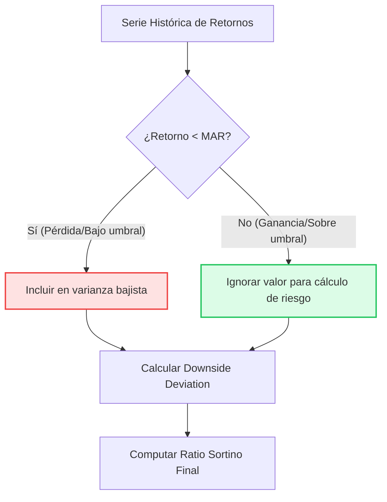

> [!abstract] Definición
> 
> El **Ratio Sortino** es una evolución analítica del [Ratio Sharpe](../portfolio/sharpe_ratio.md) diseñada para medir el rendimiento ajustado al riesgo. Su diferenciador principal es que penaliza de forma exclusiva la volatilidad a la baja (el riesgo real de pérdida), omitiendo por completo las desviaciones positivas o el éxito explosivo de la estrategia.

---

## 1. Fundamento Matemático

La ecuación estructural es idéntica a su predecesora, pero modifica el denominador e introduce un umbral de comparación dinámico y personalizable.

> [!math-blue] Fórmula del Ratio Sortino
> 
> $$Sortino = \frac{R_p - MAR}{\sigma_d}$$
> 
> Donde:
> 
> - $R_p$: Retorno del portafolio o rentabilidad generada por la estrategia.
>     
> - $MAR$ (_Minimum Acceptable Return_): El Retorno Mínimo Aceptable. Permite definir el umbral crítico de exigencia (ej. 0%, la inflación o un 5% objetivo). Todo valor por debajo del $MAR$ se clasifica como pérdida.
>     
> - $\sigma_d$ (_Downside Deviation_): Desviación a la baja. Es la desviación estándar calculada estrictamente con los retornos que caen por debajo del $MAR$.
>     

---

## 2. Flujo Lógico de Desviación a la Baja

El siguiente esquema ilustra cómo el Sortino aísla el riesgo real discriminando la volatilidad positiva:

---

## 3. Importancia Crítica en Arquitecturas Cuantitativas

Implementamos el Ratio Sortino como métrica superior en el diseño de motores de validación por tres motivos fundamentales:

### A. Evaluación de Estrategias Asimétricas

En sistemas desarrollados en **Rust** basados en el seguimiento de tendencias (_trend following_), es común enfrentar múltiples pérdidas controladas (ej. -1%) y unas pocas ganancias extremas (ej. +15%). Mientras que el Sharpe castiga el sistema asumiendo la ganancia del 15% como una penalización por desviación estándar alta, el Sortino omite este pico alcista, revelando la auténtica calidad direccional de la estrategia.

### B. Opciones y Perfiles de Pago No Lineales

Estrategias de derivados con pagos asimétricos (como la compra de _puts_ muy _Out-of-the-Money_ para protección de cartera) presentan métricas distorsionadas bajo el modelo tradicional de la Campana de Gauss. El Sortino aísla el daño estructural real frente a eventos de **CisnesNegros**.

### C. Filtro de Selección (Algoritmos Genéticos)

En nuestro _pipeline_ de generación automatizada de estrategias, se implementa como filtro de viabilidad de primer nivel.

> [!tip] Criterio de Selección en Backtesting
> 
> Exigir un $Sortino > 2.0$ asegura que el motor seleccione iteraciones que generen retornos controlando proactivamente el [Drawdown](../portfolio/drawdown.md), descartando modelos de falsa baja volatilidad general que esconden un riesgo de ruina explosivo a la baja

!**ComparativaRatioSortinoVSRatioSharpe|582**