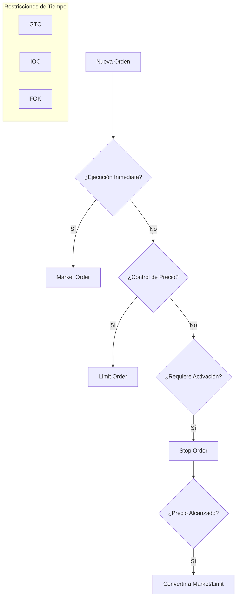

> [!abstract] Propósito
> 
> Definición y clasificación de los mecanismos de ejecución en mercados financieros, detallando su impacto en la liquidez, el riesgo de deslizamiento (_slippage_) y la prioridad de ejecución.

---

## 1. Órdenes Básicas

> [!math-blue] Orden a Mercado (Market Order)
> 
> Ejecución inmediata al mejor precio disponible en el lado opuesto del _order book_.
> 
> - **Prioridad:** Velocidad y certeza de ejecución.
>     
> - **Riesgo:** _Slippage_ elevado en baja liquidez.
>     
> - **Rol:** Tomador de liquidez (_Taker_).
>     

> [!math-green] Orden Limitada (Limit Order)
> 
> Instrucción de compra/venta a un precio específico o mejor.
> 
> - **Prioridad:** Control estricto del precio.
>     
> - **Riesgo:** Falta de ejecución si el mercado no alcanza el límite.
>     
> - **Rol:** Creador de liquidez (_Maker_).
>     

---

## 2. Órdenes Condicionales

|**Tipo**|**Activación**|**Ejecución Post-Activación**|**Uso Principal**|
|---|---|---|---|
|**Stop Market**|Precio Stop cruzado|Orden a Mercado|Cortar pérdidas (_Stop Loss_)|
|**Stop-Limit**|Precio Stop cruzado|Orden Limitada|Control de salida en alta volatilidad|

> [!warning] Riesgo de Ejecución en Stop-Limit
> 
> En eventos de _Flash Crash_, el precio puede saltar el nivel límite, dejando la orden "huérfana" y la posición expuesta a pérdidas ilimitadas.

---

## 3. Órdenes Algorítmicas y Avanzadas

### Orden Iceberg

Fragmentación de una orden de gran volumen en porciones menores. Solo la "punta" es visible en el libro público.

- **Objetivo:** Ocultar el tamaño real para evitar el _front-running_ institucional.
    

### Pegged Order

Orden limitada cuyo precio se indexa dinámicamente a una referencia del libro:

- **Best Bid:** Sigue la mejor oferta de compra.
    
- **Best Ask:** Sigue la mejor oferta de venta.
    
- **Midpoint:** Se sitúa en el punto medio del _spread_.
    

---

## 4. Parámetros de Tiempo (Time in Force)

> [!info] Definición
> 
> Condiciones que dictan la vigencia de una orden antes de su cancelación automática.

- **GTC (Good 'Til Canceled):** Activa hasta ejecución o cancelación manual.
    
- **DAY:** Expira al cierre de la sesión actual.
    
- **IOC (Immediate Or Cancel):** Ejecución inmediata parcial o total; el resto se cancela.
    
- **FOK (Fill Or Kill):** Ejecución inmediata del total o cancelación íntegra. No permite parciales.
    

---

## 5. Lógica de Flujo de Ejecución

- **GTC (Good 'Til Canceled):** La orden permanece en el libro hasta que se ejecuta o el operador la cancela manualmente.
    
- **DAY:** Expira automáticamente al final de la sesión de negociación del día.
    
- **IOC (Immediate Or Cancel):** Exige que la orden se ejecute inmediatamente en el mercado (parcial o totalmente). Cualquier porción que no se llene al instante se cancela.
    
- **FOK (Fill Or Kill):** Exige ejecución inmediata de la totalidad de la orden. Si no hay liquidez suficiente para llenarla completa al instante, se cancela entera (no admite ejecuciones parciales).

> [!tip] Recomendación de Arquitectura
> 
> Para estrategias de alta frecuencia, priorizar **IOC** sobre **FOK** para maximizar la tasa de llenado (_fill rate_) aunque sea parcial.