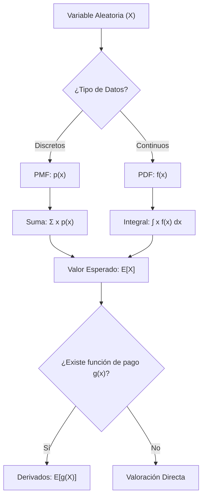
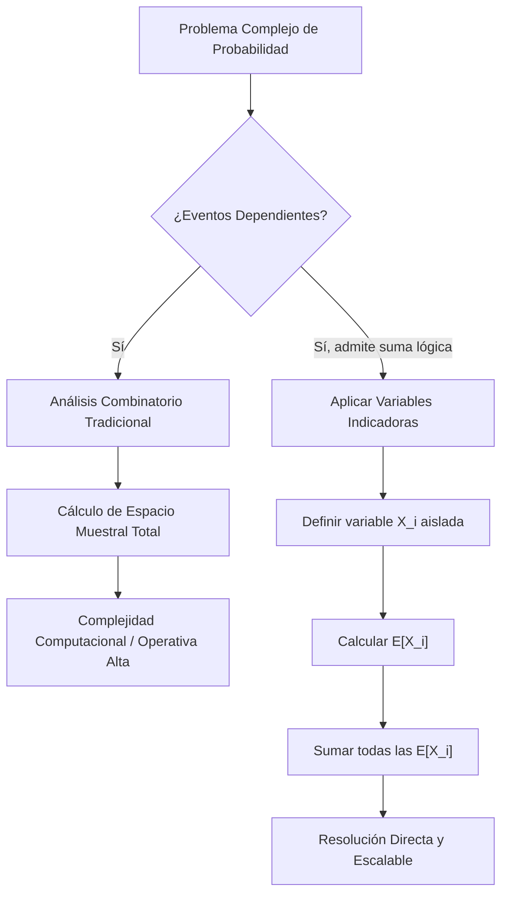

> [!abstract] Propósito
> 
> Documentar el concepto de Esperanza Matemática ($E[X]$) y su aplicación en la toma de decisiones algorítmicas y la fijación de precios de derivados en finanzas cuantitativas. Constituye el fundamento matemático para evaluar la rentabilidad teórica a largo plazo de estrategias e instrumentos financieros.

## 1. Naturaleza de los Datos: Discreto vs. Continuo

Antes de ejecutar cualquier modelo de valoración, es imperativo clasificar la naturaleza de la [Variable Aleatoria](../prob_stats/variable_aleatoria.md) observada.

### Variable Discreta (PMF)

Toma valores separados y contables. Se modela mediante una **Función de Masa de Probabilidad** (p.m.f. o $p(x)$), la cual asigna una probabilidad exacta a cada valor individual en el espacio muestral.

- **Aplicación Financiera:** Precios reales de las acciones, los cuales se mueven en _ticks_ mínimos o incrementos fijos (ej. centavos).
    

### Variable Continua (PDF)

Toma un número infinito de valores dentro de un rango continuo. Se modela mediante una **Función de Densidad de Probabilidad** (p.d.f. o $f(x)$). La probabilidad de un valor individual exacto es cero; se mide la probabilidad de que el valor caiga dentro de un rango determinado (el área bajo la curva).

- **Aplicación Financiera:** Tiempo exacto transcurrido entre dos órdenes de mercado (microestructura de mercado).
    

---

## 2. Definición Formal del Valor Esperado ($E[X]$)

El Valor Esperado representa el promedio ponderado o centro de gravedad matemático de todos los resultados posibles dentro del espacio muestral $\Omega$. Representa el valor al que converge el promedio de resultados si el experimento u operación se repite teóricamente infinitas veces. No debe confundirse con la moda (el valor más probable).

> [!math-blue] Fórmulas Fundamentales del Valor Esperado
> 
> Para variables discretas (sumatoria):
> 
> $$E[X] = \mu = \sum_{x \in \Omega} x p(x)$$
> 
> Para variables continuas (integral):
> 
> $$E[X] = \mu = \int_{\Omega} x f(x) dx$$

---

## 3. Funciones de una Variable Aleatoria ($E[g(x)]$)

En finanzas cuantitativas, la exposición al riesgo no suele ser lineal respecto al activo subyacente $x$. Los derivados y estrategias se modelan como funciones de dicho activo, representadas por $g(x)$. El cálculo del precio justo del derivado depende del valor esperado de esta función.

> [!math-purple] Valor Esperado de una Función
> 
> Para una variable discreta, el valor esperado de la función $g(x)$ se define como:
> 
> $$E[g(x)] = \sum_{x \in \Omega} g(x) p(x)$$

> [!example] Caso de Uso: Fijación de Precios de Opciones (Call)
> 
> Supongamos una Opción de Compra (Call) con un _Strike Price_ de \$100.
> 
> - **Variable aleatoria $x$:** Precio de la acción al vencimiento.
>     
> - **Función de pago $g(x)$:** $\max(x - 100, 0)$.
>     
> 
> El valor esperado del contrato hoy (ignorando la tasa libre de riesgo por simplicidad) se calcula ponderando el resultado de la función por la probabilidad de cada escenario:
> 
> $$E[g(x)] = \sum_{x \in \Omega} \max(x - 100, 0) \times p(x)$$

---

## 4. Aplicación en Entrevistas Quant

El dominio del cálculo de la esperanza matemática sobre funciones esotéricas es un componente crítico en entrevistas de empresas como Optiver, Jane Street o Citadel.

> [!tip] Construcción de Modelos Mentales
> 
> El objetivo de estos ejercicios no es evaluar la teoría profunda, sino la capacidad de mapear un problema verbal a la fórmula sumatoria $\sum x p(x)$ en tiempo real.
> 
> **Metodología de resolución:**
> 
> 1. Aislar la variable aleatoria $x$.
>     
> 2. Identificar el espacio muestral completo $\Omega$.
>     
> 3. Definir la probabilidad $p(x)$ para cada elemento de $\Omega$.
>     
> 4. Construir la función de pago $g(x)$ según las reglas del problema.
>     
> 5. Calcular la suma ponderada $E[g(x)]$.
>     

---

## 5. Diagrama de Flujo del Proceso Quant

---

# Linealidad de la Esperanza y Varianza

> [!abstract]
> 
> Documentación técnica sobre la propiedad de Linealidad de la Esperanza Matemática, la implementación de variables indicadoras para la resolución simplificada de problemas probabilísticos de alta complejidad, y la formulación estricta de la Varianza, incluyendo la rectificación de errores comunes en la literatura estadística.

## Linealidad de la Esperanza

La Esperanza Matemática (o valor esperado) posee la propiedad de linealidad. Esta característica permanece operativa incluso cuando existe una fuerte dependencia estadística entre las [VariablesAleatorias](../prob_stats/variable_aleatoria.md). Permite fragmentar problemas complejos, calcular las esperanzas individuales de componentes aislados y sumar los resultados directamente, eludiendo la reconstrucción del [QT(PE) - 6.Modelos Probabilisticos](../prob_stats/modelos_probabilisticos.md) completo.

> [!math-blue] Axiomas de Linealidad
> 
> **Multiplicación por constantes:**
> 
> $$E[aX + b] = aE[X] + b$$
> 
> **Suma de variables aleatorias:**
> 
> $$E[X_1 + X_2 + \dots + X_n] = E[X_1] + E[X_2] + \dots + E[X_n]$$

## Aplicación Práctica: Variables Indicadoras

Una variable indicadora $X_i$ actúa como una compuerta lógica binaria: asume el valor $1$ si el evento específico ocurre y $0$ en caso contrario.

> [!example] Problema de la Fila Estocástica
> 
> **Escenario:** 10 niños y 10 niñas se ordenan aleatoriamente en una fila de 20 asientos contiguos.
> 
> **Objetivo:** Determinar el número esperado de pares adyacentes de distinto género.
> 
> **Complejidad Inicial:** El [QT(PE) - 6.Modelos Probabilisticos](../prob_stats/modelos_probabilisticos.md) requiere evaluar $\binom{20}{10} = 184756$ combinaciones dependientes.

**Resolución mediante Indicadoras:**

1. **Definición del Par:** Se aísla un par adyacente (posiciones $i$ e $i+1$). En una fila de 20 estudiantes, existen 19 pares posibles.
    
2. **Cálculo de Probabilidad Aislada:**
    
    - Probabilidad (Niño en $i$ $\cap$ Niña en $i+1$): $\frac{10}{20} \times \frac{10}{19} = \frac{100}{380}$
        
    - Probabilidad (Niña en $i$ $\cap$ Niño en $i+1$): $\frac{10}{20} \times \frac{10}{19} = \frac{100}{380}$
        
    - Probabilidad conjunta para el par $i$: $\frac{200}{380} = \frac{10}{19}$
        
3. **Esperanza del Par ($X_i$):**
    
    $$E[X_i] = \left(1 \times \frac{10}{19}\right) + \left(0 \times \frac{9}{19}\right) = \frac{10}{19}$$
    
4. **Aplicación de Linealidad:**
    
    Se suman las esperanzas de los 19 pares, ignorando la dependencia secuencial.
    
    $$E[\text{Total}] = \sum_{i=1}^{19} E[X_i] = 19 \times \frac{10}{19} = 10$$
    

> [!tip]
> 
> El resultado esperado es exactamente 10 pares mixtos. Este método reduce el tiempo de resolución a segundos al transformar un problema de combinatoria dependiente en una suma aritmética simple.

## Varianza: Corrección de Antipátrones

La varianza cuantifica la dispersión promedio de los datos alrededor de su media $\mu$.

> [!math-yellow] Definición General de Varianza
> 
> $$Var(X) = E[(X - \mu)^2] = E[X^2] - E[X]^2$$

### Errores Comunes de Formulación

> [!danger] Antipadrón 1: Varianza con Constantes Aditivas
> 
> **Formulación Incorrecta:** $Var(aX + b) = a^2 Var(X) + b$
> 
> **Corrección:** Sumar una constante $b$ simplemente aplica un desplazamiento (offset) a la distribución, sin alterar la dispersión relativa de los datos. La constante se anula en la varianza.
> 
> **Formulación Correcta:**
> 
> $$Var(aX + b) = a^2 Var(X)$$

> [!danger] Antipadrón 2: Linealidad Universal de la Varianza
> 
> **Formulación Incorrecta:** $Var(X + Y) = Var(X) + Var(Y)$
> 
> **Corrección:** Esta ecuación únicamente es válida si $X$ e $Y$ son estadísticamente independientes (su covarianza es nula).
> 
> **Formulación General Correcta:**
> 
> $$Var(X + Y) = Var(X) + Var(Y) + 2Cov(X, Y)$$

## Variables i.i.d. y Diversificación

Las variables i.i.d. (Independientes e Idénticamente Distribuidas) son la base matemática para la Ley de los Grandes Números y la estructuración de portafolios diversificados.

> [!math-green] Varianza del Promedio i.i.d.
> 
> Dadas $X_1, \dots, X_n$ variables i.i.d., cada una con varianza $\sigma^2$:
> 
> $$Var(\text{promedio}) = \frac{\sigma^2}{n}$$

> [!info]
> 
> Al integrar $N$ señales predictivas o activos estadísticamente independientes, cada uno con un riesgo individual $\sigma^2$, la varianza agregada del promedio se mitiga dividiéndose por $N$. A medida que $N \to \infty$, la volatilidad tiende a $0$.

## Flujo de Decisión: Combinatoria vs Linealidad

Fragmento de código

