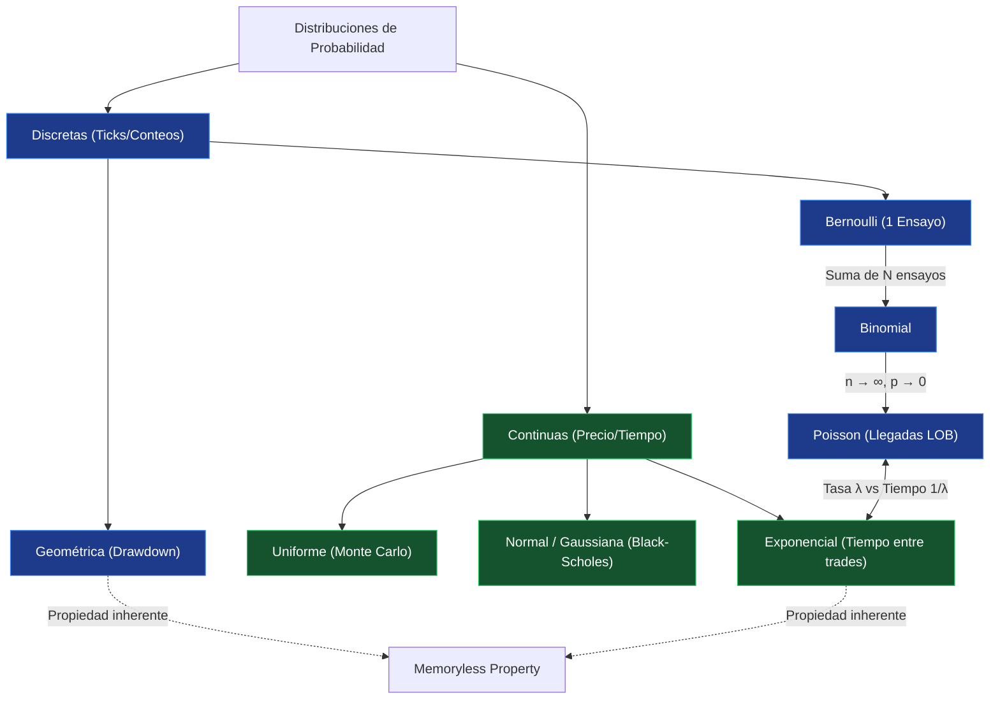

# Distribuciones Estadísticas en Finanzas Cuantitativas

> [!abstract]
> 
> Esta nota documenta el puente conceptual entre las distribuciones estadísticas teóricas y su aplicación práctica para modelar el comportamiento, riesgo y microestructura de los mercados financieros.

## 1. Función de Distribución Acumulada (CDF)

Mientras que la Función de Densidad de Probabilidad (PDF, $f(x)$) proporciona la densidad en un punto exacto, la CDF ($F_X(a)$) calcula la probabilidad acumulada desde el infinito negativo hasta un punto $a$.

> [!math-blue] Función de Distribución Acumulada
> 
> $$F_X(a) = \int_{-\infty}^{a} f(x) dx$$

> [!example] Aplicación Quant: Value at Risk (VaR)
> 
> La CDF es la base matemática del cálculo del **Value at Risk**. Si la curva representa los retornos diarios de un portafolio, calcular la CDF hasta la marca del -5% determina exactamente la probabilidad total de sufrir una pérdida del 5% o superior en una sola sesión.

## 2. Variables Discretas: El Mundo de los Ticks y Conteos

Las distribuciones discretas modelan eventos que solo toman valores enteros, fundamentales para el análisis de alta frecuencia y conteo de operaciones.

> [!math-green] Distribución de Bernoulli
> 
> Modela un evento individual con dos resultados posibles: Éxito ($p$) o Fracaso ($q = 1-p$).
> 
> **Uso Quant:** Predecir si el próximo "tick" del precio será al alza (1) o a la baja (0).

> [!math-green] Distribución Binomial
> 
> Modela la suma de múltiples ensayos de Bernoulli independientes.
> 
> **Uso Quant:** Si un algoritmo ejecuta 100 operaciones diarias con un _win-rate_ del 55% ($p = 0.55$), esta distribución define la probabilidad exacta de finalizar la sesión con 40, 50 o 60 operaciones ganadoras.

> [!math-green] Distribución de Poisson
> 
> Modela la cantidad de veces que ocurre un evento en un intervalo de tiempo fijo, gobernado por la tasa de llegada $\lambda$.
> 
> **Uso Quant:** Análisis de la microestructura del mercado. Permite estimar cuántas órdenes de compra llegarán al **Limit Order Book** en el próximo segundo.

> [!math-green] Distribución Geométrica
> 
> Modela el número de fracasos que ocurren antes de conseguir el primer éxito.
> 
> **Uso Quant:** Estimación de riesgo de racha perdedora o **Drawdown**. Calcula la probabilidad estadística de sufrir $N$ operaciones perdedoras consecutivas antes de una ganadora.

!**959**

## 3. Variables Continuas: El Mundo del Precio y el Tiempo

Las distribuciones continuas pueden tomar cualquier valor decimal, utilizándose para modelar el precio, los retornos y el tiempo.

> [!math-purple] Distribución Uniforme
> 
> Todos los números en un rango $[a, b]$ poseen la misma probabilidad de ocurrencia.
> 
> **Uso Quant:** Es el motor estocástico base para la generación de números aleatorios en simulaciones de **Monte Carlo**.

> [!math-purple] Distribución Normal (Gaussiana)
> 
> Consecuencia directa del Teorema del Límite Central (CLT). Modela la suma de múltiples eventos aleatorios independientes.
> 
> **Uso Quant:** Es el pilar (y el principal punto de fallo potencial) del modelo **Black-Scholes** para la valoración de opciones, el cual asume que los retornos logarítmicos del precio se distribuyen normalmente.

> [!math-purple] Distribución Exponencial
> 
> Modela el tiempo transcurrido hasta que ocurre el siguiente evento.
> 
> **Uso Quant:** En mercados de alta liquidez, el tiempo (en milisegundos) que transcurre entre una transacción y la siguiente sigue esta distribución.

!**978**

## 4. Propiedades Clave y Dualidades

Comprender cómo estas distribuciones mutan e interactúan es esencial para la construcción de modelos complejos.

### A. Convergencia Binomial-Poisson

Si una distribución Binomial opera con un número de ensayos ($n$) tendiendo a infinito y una probabilidad de éxito ($p$) tendiendo a cero, converge matemáticamente hacia una distribución de Poisson donde $\lambda = np$.

- **Ejemplo:** Millones de traders ($n$ alto) con una probabilidad ínfima de ejecutar una orden en un milisegundo específico ($p$ bajo). El comportamiento colectivo resultante es un flujo constante de órdenes modelable vía Poisson.

### B. Dualidad Poisson-Exponencial

Ambas distribuciones son mutuamente dependientes. Si las órdenes llegan a una tasa de Poisson de $\lambda = 5$ por segundo, el tiempo de espera entre cada orden sigue una distribución Exponencial con un promedio de $1/\lambda = 0.2$ segundos.

### C. La Propiedad "Memoryless" (Falta de Memoria)

Las distribuciones Geométrica y Exponencial carecen de memoria estadística. La probabilidad de que un evento ocurra en el próximo intervalo de tiempo es constante, independientemente de cuánto tiempo haya transcurrido previamente.

> [!danger] Riesgo Sistémico: La Ilusión del Random Walk
> 
> Asumir que los mercados financieros carecen de memoria (como sugiere la teoría del Random Walk estricto) implica ignorar el _momentum_ estructural o el pánico acumulado. En condiciones reales, si un activo experimenta un _sell-off_ durante 5 horas, la probabilidad del siguiente movimiento bajista está fuertemente condicionada por ese historial, violando la propiedad "Memoryless".

## Mapa Conceptual de Relaciones

