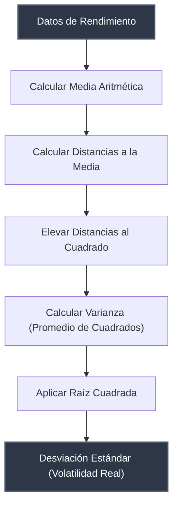

> [!abstract] Propósito
> 
> La varianza y la desviación estándar constituyen la base matemática para la medición de la volatilidad y la gestión de riesgos en el trading. Estas métricas cuantifican la dispersión de los rendimientos de un activo respecto a su media, permitiendo evaluar el riesgo inherente a una curva de capital.

> [!example] Ejemplo Práctico: Dispersión de Rendimientos
> 
> Comparativa de dos perfiles con el mismo rendimiento promedio (+1% diario) durante 5 días:
> 
> - **Trader A:** +1%, +2%, -1%, +1%, +2% (Curva estable, baja volatilidad).
>     
> - **Trader B:** +10%, -8%, +15%, -12%, +0% (Curva errática, alta volatilidad).
>     
>     Las métricas estadísticas cuantifican matemáticamente esta diferencia estructural.
>     

## 1. La Varianza ($\sigma^2$)

La varianza mide el promedio de las distancias al cuadrado entre cada dato individual y la media aritmética del conjunto.

> [!math-red] Definición y Propiedades de la Varianza
> 
> Al elevar las distancias al cuadrado se logra:
> 
> 1. Transformar todos los valores a positivos, evitando la anulación entre ganancias y pérdidas.
>     
> 2. Penalizar exponencialmente los valores extremos (un evento de -10% impacta significativamente más que diez eventos de -1%).
>     
> 
> **Problema de lectura:** El resultado se expresa en unidades al cuadrado (ej. "porcentajes al cuadrado"), lo que dificulta su interpretación en escenarios reales.

## 2. La Desviación Estándar ($\sigma$)

La desviación estándar es la raíz cuadrada de la varianza. Su función principal es retornar el valor de dispersión a su unidad de medida original.

> [!math-blue] Interpretación de la Desviación Estándar
> 
> Indica cuánto se desvía, en promedio, un dato cualquiera respecto a la media.
> 
> - **Aplicación:** Si un activo posee un retorno promedio del 5% y una desviación estándar del 2%, estadísticamente sus retornos habituales fluctuarán en el rango de [3%, 7%].
>     

## 3. Ejemplo de Cálculo

Retornos diarios de un activo durante 4 días: `2%, 4%, 4%, 6%`.

> [!math-green] Desarrollo del Cálculo Estadístico
> 
> **Paso 1: Cálculo de la Media**
> 
> $$Media = \frac{2 + 4 + 4 + 6}{4} = \frac{16}{4} = 4\%$$
> 
> **Paso 2 y 3: Distancias a la media y elevación al cuadrado**
> 
> - Día 1: $(2 - 4)^2 = (-2)^2 = 4$
>     
> - Día 2: $(4 - 4)^2 = (0)^2 = 0$
>     
> - Día 3: $(4 - 4)^2 = (0)^2 = 0$
>     
> - Día 4: $(6 - 4)^2 = (2)^2 = 4$
>     
> 
> **Paso 4: Cálculo de la Varianza (poblacional)**
> 
> $$Varianza = \frac{4 + 0 + 0 + 4}{4} = 2$$
> 
> **Paso 5: Cálculo de la Desviación Estándar**
> 
> $$Desviacion = \sqrt{2} \approx 1.41\%$$

> [!info] Conclusión Analítica
> 
> El activo rinde un 4% diario en promedio. Las variaciones típicas del activo se desvían un 1.41% por encima o por debajo de este eje central.

## 4. Flujo Lógico de Procesamiento

> [!warning] Sensibilidad a Extremos (Cisnes Negros)
> 
> La alteración de un solo punto de datos, alejándolo del grupo base, incrementa la desviación estándar de manera acelerada. Esto ocurre por la naturaleza exponencial de la fórmula al elevar al cuadrado las distancias, evidenciando el impacto de los eventos de cola en el riesgo total de un portafolio.