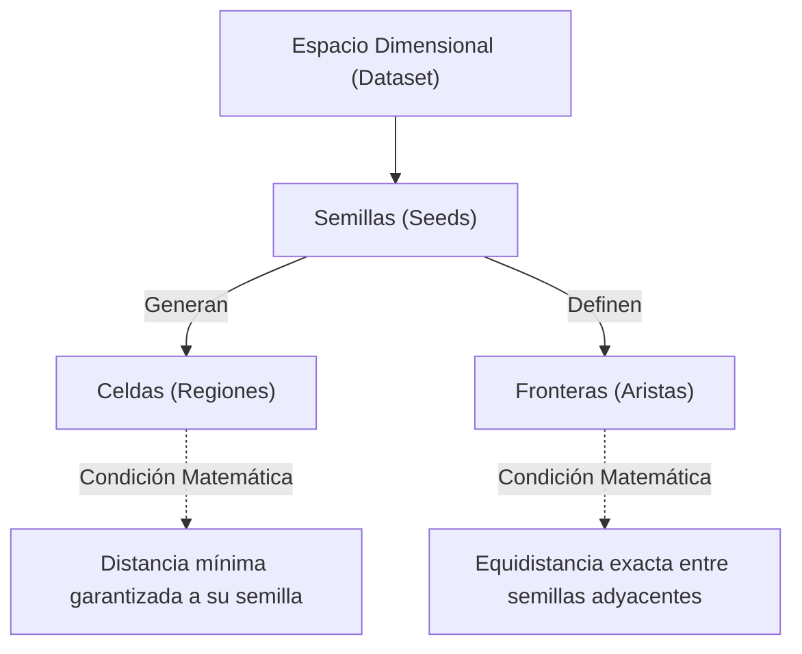

# Teselación de Voronoi

> [!abstract] Propósito 
> La Teselación de Voronoi (o Diagrama de Voronoi) es una estructura matemática y geométrica generada al dividir un espacio métrico en regiones basándose en la proximidad a un conjunto específico de puntos (semillas).

> [!math-purple] Axioma de Proximidad 
> Dado un conjunto de puntos en un espacio, el espacio se subdivide en celdas de modo que cualquier coordenada dentro de una celda específica está estrictamente más cerca de su punto generador (semilla) que de cualquier otro punto en el conjunto.

## Componentes Principales de la Teselación

La arquitectura topológica de un Diagrama de Voronoi se desglosa en tres elementos fundamentales:

1. **Las Semillas (Seeds)** Son los puntos de origen o coordenadas ancla que definen el mapa. En contextos de Machine Learning, estas semillas representan los datos de entrenamiento (ej. observaciones en un algoritmo de [KNearestNeighbors](../ml/modelos_lineales_knn.md)).
    
2. **Las Celdas (Regiones de Voronoi)** Son los polígonos o volúmenes geométricos que rodean y encierran a cada semilla. Cualquier coordenada espacial que caiga dentro de los límites de una celda tiene a esa semilla como su punto más cercano en todo el universo dimensional.
    
3. **Las Fronteras (Aristas)** Son las líneas o hiperplanos que delimitan y separan las celdas. Representan el lugar geométrico donde la distancia matemática entre dos semillas adyacentes es idéntica (empate de distancias). Si un punto se sitúa exactamente sobre una frontera, es equidistante a las semillas que comparten dicha línea.
    
## Topología y Relaciones

## Modelo Mental Práctico

> [!example] Analogía de Distribución Logística (Pizzerías) 
> Imagina un mapa urbano con 5 pizzerías distribuidas por la ciudad.
> 
> **Regla de asignación:** Cada cliente debe pedir obligatoriamente a la pizzería que esté a menor distancia en línea recta.
> 
> **Resultado:** Al trazar las zonas de reparto, el mapa queda dividido en polígonos.
> 
> - Las **Semillas** son las 5 pizzerías.
>     
> - Las **Celdas** son los territorios exclusivos de reparto de cada pizzería.
>     
> - Las **Fronteras** son las calles exactas donde un cliente está a la misma distancia de dos pizzerías distintas. Este mapa poligonal resultante es, por definición, una Teselación de Voronoi.

!**999**