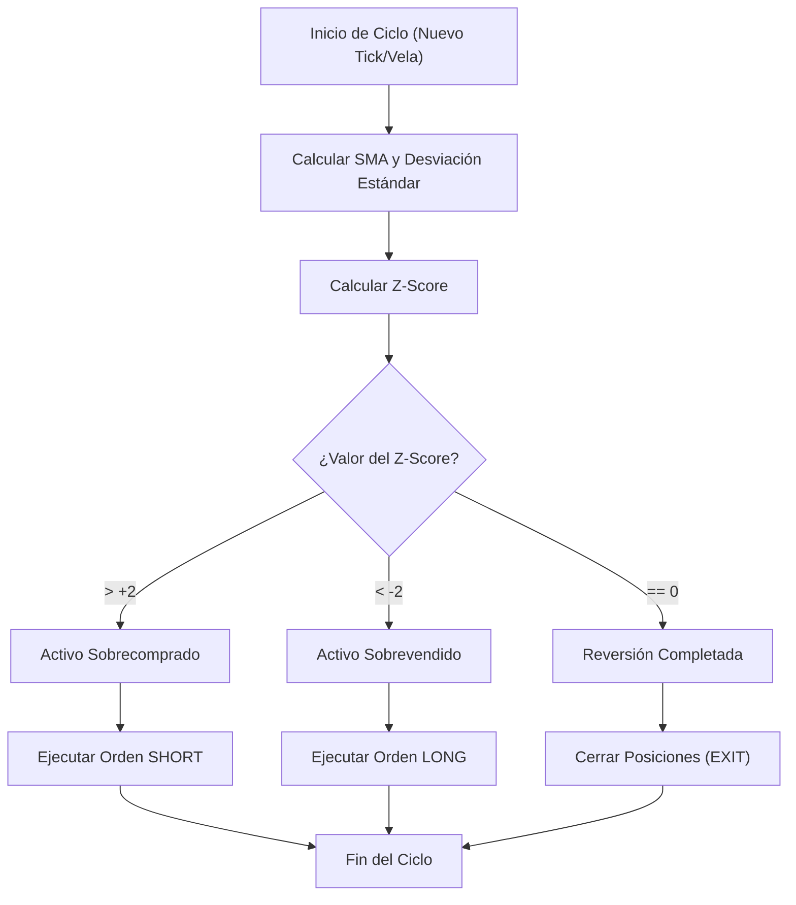

> [!abstract] Resumen
> 
> La **Reversión a la Media** (Mean Reversion) es una premisa financiera y matemática que postula que los precios y retornos de un activo tienden a volver a su promedio histórico a lo largo del tiempo. Las desviaciones extremas se consideran anomalías temporales explotables en el **Trading Cuantitativo**.

## Concepto Core

El precio de un activo interactúa con su media móvil como si estuviera unido por una banda elástica. Las expansiones direccionales impulsadas por pánico o euforia estiran esta banda, incrementando la probabilidad matemática de un retroceso ("snapback") hacia el promedio.

Para cuantificar la tensión de esta banda, se emplea la métrica de estandarización estadística conocida como **Z-Score**.

## Z-Score: Métrica de Estandarización

El Z-Score, o puntuación estándar, mide la cantidad de desviaciones estándar que un punto de datos específico se aleja de su media. Actúa como un mecanismo de estandarización, eliminando el ruido del precio absoluto y convirtiendo cualquier movimiento en una métrica universal de anomalía.

> [!math-blue] Fórmula del Z-Score
> 
> $$Z = \frac{X - \mu}{\sigma}$$
> 
> Donde:
> 
> - $X$: Precio actual del activo.
>     
> - $\mu$: Media del precio (generalmente una **Media Móvil Simple** o SMA de $N$ periodos).
>     
> - $\sigma$: [Desviación Estándar](../prob_stats/varianza_desviacion.md) de los retornos o precios durante los mismos $N$ periodos (volatilidad).
>     

> [!info] Equivalencia Técnica
> 
> El funcionamiento matemático del Z-Score es la base del indicador técnico **Bandas de Bollinger**. Tocar la banda superior equivale estructuralmente a un Z-Score de $+2$, mientras que tocar la banda inferior equivale a un Z-Score de $-2$.

## Arquitectura de la Estrategia Algorítmica

Basándose en la distribución normal, el precio debe oscilar entre un Z-Score de $-2$ y $+2$ aproximadamente el 95% del tiempo. El algoritmo busca ineficiencias fuera de este rango.

### Lógica de Ejecución

1. **Cálculo Constante:** En cada nuevo tick o vela temporal, el sistema recalcula la SMA ($\mu$), la volatilidad ($\sigma$) y el Z-Score dinámico.
    
2. **Señal Short (Venta):** Si $Z-Score > 2$, el activo está sobrecomprado. La tensión es alcista y el algoritmo abre posición corta apostando al retroceso bajista.
    
3. **Señal Long (Compra):** Si $Z-Score < -2$, el activo está sobrevendido. La tensión es bajista y el algoritmo abre posición larga apostando al rebote alcista.
    
4. **Exit (Toma de Beneficios):** La posición se liquida cuando el Z-Score retorna a $0$ (el precio cruza la media).
    

## Riesgos y Consideraciones de Diseño

> [!danger] Peligro Crítico: Regímenes de Tendencia
> 
> La reversión a la media requiere que la serie temporal cumpla con el criterio de **[Estacionariedad](../maths/analisis_series_temporales.md)** (media relativamente constante). En mercados con tendencias estructurales (ej. un avance biotecnológico), el Z-Score puede marcar niveles extremos prolongados ($+4$ o $+5$). Un algoritmo ingenuo continuará abriendo posiciones en contra de la tendencia, resultando en liquidación.

> [!tip] Aplicación Recomendada: Pairs Trading
> 
> Para mitigar el riesgo direccional, las estrategias basadas puramente en Z-Score rara vez operan activos individuales. Se despliegan arquitecturas de **[Pairs Trading](../strategies/pairs_trading.md)**, operando el _spread_ (diferencial) entre dos activos cointegrados (ej. Coca-Cola vs. Pepsi), asegurando matemáticamente la estacionariedad de la serie temporal evaluada.